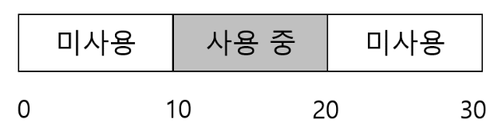

# 20. 빈 공간 관리
#OS/OSTEP/이론/가상화

 운영체제, 또는 C의 malloc 라이브러리는 프로세스의 메모리를 관리하는 대표적인 시스템이다. 이번 챕터에선 메모리 관리 시스템에서 **빈 공간 관리**와 관련된 문제를 다룬다.

 만약 관리하고 있는 공간의 크기가 **고정 단위**로 나눠져있다면, 고정 크기 단위의 리스트를 유지하면 되기 때문에 **관리가 쉽다.** 하지만 공간이 **가변 크기 빈 공간**들의 집합으로 구성되어 있는 경우 빈 공간 관리가 **어려워진다.** 라이브러리 수준에서, 그리고 세그멘테이션을 사용하는 OS 수준에서 모두 **외부 단편화**가 존재한다. 빈 공간이 메모리 할당 요청에 따라 계속 분할되어 단편화된다.

그렇다면, **가변 크기** 요구를 충족시켜야 할 때 **단편화를 최소화**하기 위해 **어떤 전략**을 사용해야 할까?

## 20.0 이전 챕터 세그멘테이션과 이어지는 내용
세그멘테이션으로 인해 외부 단편화 문제가 발생했다. 각 세그먼트는 **연속된** 메모리여야 했고, 프로세스들이 생성/종료되며 메모리를 반환하면 **중간중간 작은 구멍(hole)** 들이 생긴다.
```
[10KB 사용] [8KB 빈] [12KB 사용] [3KB 빈] [7KB 사용]
```

총 빈 공간은 많지만, 연속된 10KB가 없어 **10KB 요청 실패** 같은 문제가 생긴다. 이것이 세그멘테이션의 **가장 큰 약점**이었다

### 프로세스 내부 힙에서도 발생
운영체제는 세그멘테이션으로 “프로세스 전체 주소 공간”을 관리하지만, 프로세스 내부에서는 `malloc()`이 또 다음 같은 일을 하고 있다
- `malloc(100)`
- `malloc(20)`
- `free(ptr)`
…
이런 작업을 반복하면 힙 내부에서도 똑같은 외부 단편화가 생긴다.
```
[100B 사용][50B 빈][200B 사용][30B 빈][320B 사용]
```

세그멘테이션에서 본 단편화 문제는 실제로 **사용자 수준 힙(malloc/free)** 에서도 다시 등장한다.

## 20.1 가정
이번 챕터에서의 논의는 사용자 수준 메모리 할당 라이브러리에 존재하는 메모리 할당 기법의 발전 역사에 초점을 맞춘다. (ex. `malloc()`, `free()`)
- `void *malloc(size_t size)` 는 **변수로 size**를 받아 **요청된 크기와 같거나 큰 영역을 가리키는 void 포인터**를 반환한다. 
- `free(void *ptr)`는 포인터를 인자로 전달받고 해당 영역을 해제한다. 
  - 해제할 때는 크기 정보를 전달하지 않는다. 
  - 라이브러리가 포인터만으로 해제하고자 하는 메모리 영역의 크기를 파악해야 한다.

라이브러리가 관리하는 공간은 역사적으로 heap으로 불리며, 힙의 빈 공간을 관리하는 데는 일반적으로 linkedList가 사용된다. (영역 내의 모든 빈 청크에 대한 주소를 가진다.) 반드시 리스트일 필요는 없다.

**세그멘테이션을 써도 내부 단편화가 나타날 수 있다**. 예를 들면, 할당기가 요청한 크기보다 더 큰 메모리 청크를 할당한 경우에 해당한다. 하지만 **이번 챕터에서는 외부 단편화 방지에 중점**을 둔다. 

또한, 클라이언트에게 할당된 메모리는 다른 위치로 재배치될 수 없다고 가정한다. 이에 따라 단편화 해결에 유용하게 사용되는 빈 공간의 **압축(compact)**은 이 경우에 사용이 불가능하다.

## 20.2 저수준 기법들
할당기에서 사용되는 일반적인 기법을 알아보자. 대표적으로 다음과 같은 기법이 있다.
1. 분할과 병합
2. 할당된 공간의 크기 파악: 할당된 영역의 크기를 빠르고 쉽게 파악하는 방법
3. 빈 공간 리스트 내장: 빈 공간과 사용 중인 공간을 추적하기 위해 빈 공간 내에 간단한 리스트를 구현하는 방법

### 분할과 병합
free list는 힙에 있는 빈 공간들의 집합이다.
<!-- {"width":492} -->
<!-- {"width":485} -->
- 이 힙의 빈 공간 리스트에는 2개의 원소가 있다. (0\~9, 20\~29)
- 10바이트를 초과하는 모든 요청은, 해당 요청을 처리할 메모리 청크가 없어 NULL을 반환한다.
- 10바이트에 해당하는 요청은 둘 중 하나를 사용하면 된다.

**10바이트보다 적은 요청에 대해서는 어떻게 처리할까?**
- 만약 1바이트만 요청했다면, 할당기는 **분할(spliting)**이라는 작업을 수행한다.
- 요청을 만족시킬 수 있는 빈 청크를 찾아 이를 둘로 분할한다.
  - 첫 번째 청크는 호출자에게 반환되고, 두 번째 청크는 리스트에 남게 된다.

현재 10바이트 짜리 두 개의 청크가 있고, 두 번째 청크를 사용하기로 했다면 최종적으로 아래와 같이 free list가 구성된다.
<!-- {"width":588} -->
- 리스트의 모습은 바뀌지 않았다. 단순히 빈 공간의 시작 주소, 그리고 길이 값만 변경되었다.
- **요청이 특정 빈 청크의 크기보다 작은 경우 분할 기법을 사용한다.**

분할 기법과는 항상 **병합(coalescing)**이라는 기법이 같이 동반된다. 다시 예시의 첫번째 상태로 돌아가보자.
<!-- {"width":510} -->
<!-- {"width":573} -->
여기서, 사용 중이던 중간 공간을 반환한다면 free list에 해당 청크가 추가되어 아래와 같이 될 것이다.
<!-- {"width":794} -->
여기서 만약 20바이트 메모리 요청이 온다면? 실제론 30바이트가 미사용 중이지만, 10x3 로 **쪼개져있어 실패해버린다.**

할당기가 이 문제를 해결하기 위해, **메모리 청크가 반환될 때 빈 공간들을 병합**한다. 
- 메모리 청크를 반환할 때 해제되는 청크의 주소와 바로 인접한 빈 청크의 주소를 살펴본다.
- 새로 해제된 빈 공간의 왼쪽의 빈 청크와 바로 인접해 있다면 그들을 하나의 더 큰 빈 청크로 병합한다.
<!-- {"width":378} -->
병합 기법을 통해 큰 공간을 응용프로그램에게 제공할 수 있게 되었다.

### 할당된 공간의 크기 파악
`free(void *ptr)`은 크기를 매개변수로 받지 않는다. 포인터가 인자로 전달되면 malloc 라이브러리는 해제되는 메모리 영역의 크기를 빠르게 파악하여 그 공간을 빈 공간 리스트에 추가시킬 수 있어야 한다.

**어떻게** 빠르게 파악할 수 있을까? 이 작업을 위해, 할당기는 추가 정보를 **헤더(header)** 블럭에 저장한다. 헤더 블럭은 메모리에 유지되며 해제될 청크 바로 직전에 위치한다.
<!-- {"width":619} -->
- `ptr = malloc(20);`

헤더에는 할당된 공간의 크기가 반드시 포함되어야 한다. 또한, 해제 속도를 향상시키기 위한 추가 포인터, 무결성 검사를 위한 매직 넘버, 기타 정보를 추가로 저장할 수 있다.
<!-- {"width":573} -->
```c
typedef struct __header_t {
	int size;
	int magic;
} header_t;
```

만약 사용자가 `free(ptr)`을 호출하면 라이브러리는 
1. 헤더의 시작 위치를 파악하기 위해 포인터 연산을 한다.
```c
void free(void *ptr) {
	header_t *hptr = (void *)ptr - sizeof(header_t);
```
2. 헤더가 가리키는 포인터를 얻어내면, 라이브러리는 매직 넘버가 기대하는 값과 일치하는지 비교하여 **안정성 검사**를 실시한다.
3. 새로 해제된 여역의 크기를 간단한 수학을 통해 계산한다.
   - 영역(빈 청크의 크기 N) + 헤더의 크기
   - 위 예제에선 `20 + 8 = 28`

여기서 알 수 있는건, **사용자가 N 바이트 메모리 청크를 요청하면, 라이브러리는 크기 N의 빈 청크를 찾는 것이 아니라 `빈 청크의 크기 + 헤더의 크기`인 청크를 탐색한다는 것이다.**

### 빈 공간 리스트 내장
malloc()을 구현할 때는, malloc() 안에서 다시 malloc()을 호출할 수 없다. 따라서 사용할 빈 공간 리스트(free list)를 힙 내부의 빈 공간 자체에 저장해야 한다. **빈 블록 자체가 free list의 노드가 되어야 한다.**

**최초 청크 추가**
만약 4KB 크기의 메모리(힙) 청크가 있다고 해보자. 이를 free list로 관리하기 위해선 `1. 먼저 리스트를 초기화`해야 한다.
이 리스트 노드는 다음과 같은 구조를 갖는다.
```c
typedef struct __node_t {
	int size;
	struct __node_t *next;
} node_t;
```

이제 힙을 초기화하고 힙에 빈 공간의 첫 번째 원소를 넣어보자. 힙은 시스템 콜 `mmap()`을 호출하여 얻어진 영역에 구축된다고 가정한다.
```c
node_t *head = mmap(NULL, 4096, PROT_READ|PROT_WRITE, MAP_ANON|MAP_PRIVATE, -1, 0);
head->size = 4096 - sizeof(node_t);
head->next = NULL;
```

이 코드 실행 결과, 리스트는 크기 4088의 항목 하나를 가지게 된다. head 포인터는 영역의 시작 주소를 담고 있다.
<!-- {"width":800} -->

**최초 메모리 할당 요청**
이제 100바이트 메모리 청크가 요청되면, 라이브러리는 충분한 크기의 청크를 찾는다. 4088짜리가 선택된다.
헤더의 크기를 8바이트라고 하면, 108(=100 + 8)바이트 짜리 청크와 나머지 3980바이트짜리 청크 두 개로 **분할**된다.
- `free()`에서 사용할 수 있도록 8바이트 헤더를 추가해줘야 한다.
<!-- {"width":588} -->

**3개의 공간이 할당된 경우**
<!-- {"width":597} -->
- 3개의 영역이 할당되어도, free list는 head가 가리키는 하나의 노드로 구성되어 있다.

만약 여기서 `free(16500)`을 호출하여 두 번째 영역이 해제된다면? 16500이란 값(sptr) 은 메모리 영역의 시작 주소 16384, 첫번째 메모리 청크의 크기 108, 해제되는 청크의 헤더 8바이트를 모두 더해서 나온 값이다. 

라이브러리는 빠르게 빈 공간의 크기를 파악하고, 빈 청크를 빈 공간 리스트에 삽입한다. 
<!-- {"width":544} -->
- free list의 첫 번재 원소는 작은 빈 청크이고, 두 번째 원소는 큰 빈 청크(3764)이다.
- 하나 이상의 원소를 가지지만 단편화가 발생했다.

마지막으로 2개의 사용중인 청크가 해제된다고 해보자. **병합이 없다면 작은 단편으로 이루어진 free list가 될 것이다.**
<!-- {"width":597} -->
리스트를 **병합**하지 않아 발생한 일이다. 해결책은, 리스트를 순회하며 인접한 청크를 **병합**하면 된다. 병합하면 힙은 전체 하나의 큰 청크가 된다.

### 힙의 확장
힙 공간이 부족한 경우에 어떻게 해야할까? 가장 쉬운 방법은 실패를 반환하는 것이다.
많은 전통적인 할당기는 힙을 모두 소진하면 운영체제로부터 더 많은 메모리를 땡겨오려고 한다. `sbrk()` 같은 시스템 콜을 호출하여 메모리를 땡겨오고, 확장된 영역에서 새로운 청크를 할당한다.

운영체제는 sbrk 요청을 수행하기 위해 빈 물리 페이지를 찾아 요청 프로세스의 주소 공간에 매핑한 후, 새로운 힙의 마지막 주소를 반환한다.

## 20.3 기본 전략
지금까지는 하나의 빈 힙 청크에서 메모리 할당 요청을 받아 메모리를 할당해줬다. 만약 빈 메모리 청크가 여러개라면 어떤 것을 선택해서 할당해줄 것인가?

빈 공간 할당을 위한 기본 전략을 살펴보자. 이상적인 할당기는 빠른 속도로 단편화를 최소화하며 할당해야 한다. 하지만 할당/해제는 프로그래머에 의해 결정되므로 어떤 전략이 가장 좋다고 할 수 없다. 입력이 잘 맞지 않으면 성능이 매우 좋지 않을 수도 있다.

### 최적 적합(Best Fit, a.k.a 최소 적합)
요청한 크기와 같거나 더 큰 빈 메모리 청크를 찾는다. 후보 그룹 중에서 가장 작은 크기의 청크**(최적 청크)**를 반환하는 것이다. 
- 리스트를 한 번 전체 순회를 해야 한다. O(n)
- 최적 적합은 공간의 낭비를 줄이려고 노력하지만, 빈 블럭을 찾기 위해 **항상 전체 검색**을 해야 하므로 엄청난 **성능 저하**를 초래한다.

### 최악 적합(Worst Fit)
최적 적합의 반대 방식이다. **가장 큰 빈 청크**를 찾아 요청된 크기만큼 반환하고 남는 부분은 빈 공간 리스트에 계속 유지한다.
- 최적 적합 방식에선 수 많은 작은 청크가 발생하지만, **최악 적합에선 커다란 빈 청크를 남기려고 시도하는 것이다.**
- 이 방식도 빈 공간 **전체를 탐색**해야 하므로 **높은 비용을 지불**해야 한다.
- 단편화도 엄청 많이 발생하면서 오버헤드가 크다.

### 최초 적합(First Fit)
**요청보다 큰** **첫 번째 블럭**을 찾아서 요청만큼 반환한다. 
- **속도가 빠르다**는 장점이 있다. 항상 빈 공간 리스트 전체를 탐색할 필요가 없기 때문이다.
- 리스트의 시작에 크기가 작은 객체가 많이 생길 수 있다.
  - 할당기가 빈 공간 리스트의 순서를 관리해줌으로써 해결할 수 있다.
  - **주소 기반 정렬** 방식을 사용하여 병합을 쉽게하고, 단편화를 감소시킬 수 있다.

### 다음 적합(Next Fit)
항상 리스트의 처음부터 탐색하지 않고, 마지막으로 찾았던 원소를 가리키는 포인터를 유지하여 리스트 전체에 균등하게 분산시킨다.
- **리스트의 첫 부분에만 단편이 집중적으로 발생하는 것을 방지**한다.
- 전체 탐색을 하지 않아 최초 적합의 성능과 비슷하다.

### 예제
<!-- {"width":567} -->
크기 15짜리 요청이 들어온다면? **최적 적합 방법**은 20 청크를 선택한다.
<!-- {"width":544} -->
- 최적 적합 방법에선 작은 빈 청크가 자주 남는다.

최악 적합 방식에선 가장 큰 청크(30)을 찾고, 최초 적합 방식에선 가장 먼저 찾은 청크(30)을 찾는다.
<!-- {"width":550} -->
- 최초/최악 방식이 같은 결과를 도출했다. 탐색 비용에선 차이가 난다.

## 20.4 다른 접근법
메모리 할당을 향상시키기 위한 여러 기술과 알고리즘에 추가로 제안되었다.

### 개별 리스트
별도의 **개별 리스트(segregated list)**를 사용하는 방식이다. 특정 응용 프로그램이 한두 개 자주 요청하는 크기가 있다면, 그 크기의 객체를 관리하기 위한 별도의 리스트를 유지한다. 다른 모든 요청은 일반적인 메모리 할당기로 전달된다.

특정 크기를 위한 청크를 유지함으로써 단편화 가능성을 상당히 줄일 수 있다. 요청된 크기만큼 청크가 존재하므로 검색이 필요하지 않아 할당과 해제가 빠르다.

이 방식을 도입하면 새로운 문제가 생겨난다.
- 지정된 크기의 메모리 풀과 일반적인 메모리 풀에 얼마만큼 메모리를 할당해야 하는지 -> 슬랩 할당기로 해결

**슬랩 할당기**
커널이 부팅될 때 커널 객체를 위한 여러 객체 캐시를 할당한다. (커널 캐시: 락, 파일 시스템 등에서 자주 요청되는 자료구조)
객체 캐시는 지정된 크기의 객체들로 구성된 빈 공간 리스트이고, 메모리 할당/해제 요청을 빠르게 처리하기 위해 사용된다.
- 기존에 할당된 캐시 공간이 부족하면 상위 메모리 할당기에 추가 **슬랩**을 요청한다. 
- 반대로, 슬랩 내 객체들에 대한 참조 횟수가 0이 되면 상위 메모리 할당기는 이 슬랩을 회수할 수 있다.

슬랩 할당 방식은 빈 객체들을 사전에 초기화된 상태로 유지한다는 점에서 개별 리스트 방식보다 우수하다. 자료구조의 찾은 초기화와 반납을 피할 수 있기 때문이다.

### 버디 할당
빈 공간의 합병은 매우 중요하기에 간단하게 구현할 수 있는 방법들이 설계되었다. 이진 버디 할당기가 좋은 예시이다.
빈 메모리는 2^n의 하나의 큰 공간으로 생각되어, 메모리 요청이 발생하면 요청 충족을 위한 충분한 공간이 발견될 때 까지**(너무 작아져서 요청 만족이 안될 때 까지)** 빈 공간을 2개로 분할한다. 
<!-- {"width":485} -->
- 2의 거듭제곱 크기 만큼의 블럭만 할당할 수 있기 때문에 내부 단편화로 고생할 수 있다.

**블럭이 해제**될 때 버디 할당의 장점이 드러난다. 예를 들어, 8KB 블럭을 빈 공간 리스트에 반환하면 할당기는 버디 8KB가 비어 있는지 확인한다. 비어있다면 병합하여 16KB 블럭으로 만든다. 또 16KB 블럭이 비어있으면 병합한다. **재귀 합병 과정**을 거치는 것이다. 전체 빈 공간이 복원되거나 버디가 사용 중이라는 것이 밝혀질 때 까지 올라간다.

버디 할당이 잘 동작하는 이유는, 특정 블럭의 버디를 결정하는 것이 쉽다는 것이 있다. 각 버디 쌍의 주소는 1비트만 다르기 때문이다.

### 기타 아이디어
앞에서 살펴본 접근 방식의 한 가지 문제점은 **확장성**이다. 빈 공간의 개수가 늘어남에 따라 리스트 검색이 매우 느려질 수 있다.
정교한 할당기는 복잡한 자료구조를 사용해 단순함을 포기하고, 성능을 챙기기도 한다. 균형 이진트리, 스플레이트리, 부분 정렬 트리 등이 좋은 예시이다.

현대 시스템은 멀티프로세서 환경에서 동작한다. 멀티프로세서를 위해 할당기를 최적화하려고 노력한다. (ex. Berger, Evans)

## 20.5 요약
이번 챕터에선 가장 기본적인 메모리 할당기를 논의했고, 이 할당기들은 많은 곳에 존재한다. C 프로그램, 운영체제에도 존재한다.
**시스템을 구축하는데 많은 선택사항이 있고, 워크로드를 정확이 이해할 수록 워크로드에 대해 더 잘 작동하도록 조정할 수 있다.**
(백엔드 개발자라면 이 말에 공감이 될 것 같다.)

현대 컴퓨터 시스템은 다양한 워크로드에 대해 빠르고 효율적이고 확장성이 좋은 할당기를 만든다.

## 구현 코드 실행 결과
```
=== First Fit 전략 ===
초기 상태
Heap size = 64
  [0~63, size=64, FREE]

-- malloc(10) -> 0
Heap size = 64
  [0~9, size=10, USED]
  [10~63, size=54, FREE]

-- malloc(20) -> 10
Heap size = 64
  [0~9, size=10, USED]
  [10~29, size=20, USED]
  [30~63, size=34, FREE]

-- malloc(8) -> 30
Heap size = 64
  [0~9, size=10, USED]
  [10~29, size=20, USED]
  [30~37, size=8, USED]
  [38~63, size=26, FREE]

-- free(10) (가운데 블록 해제)
Heap size = 64
  [0~9, size=10, USED]
  [10~29, size=20, FREE]
  [30~37, size=8, USED]
  [38~63, size=26, FREE]

-- free(0) (왼쪽 블록 해제 -> 병합)
Heap size = 64
  [0~29, size=30, FREE]
  [30~37, size=8, USED]
  [38~63, size=26, FREE]

-- free(30) (마지막 블록 해제 -> 전체 병합)
Heap size = 64
  [0~63, size=64, FREE]

-- malloc(50) -> 0
Heap size = 64
  [0~49, size=50, USED]
  [50~63, size=14, FREE]

-- malloc(100) -> -1 (힙 부족 예상)
Heap size = 64
  [0~49, size=50, USED]
  [50~63, size=14, FREE]


=== Best Fit 전략 ===
초기 상태
Heap size = 64
  [0~63, size=64, FREE]

-- malloc(10) -> 0
Heap size = 64
  [0~9, size=10, USED]
  [10~63, size=54, FREE]

-- malloc(20) -> 10
Heap size = 64
  [0~9, size=10, USED]
  [10~29, size=20, USED]
  [30~63, size=34, FREE]

-- malloc(8) -> 30
Heap size = 64
  [0~9, size=10, USED]
  [10~29, size=20, USED]
  [30~37, size=8, USED]
  [38~63, size=26, FREE]

-- free(10) (가운데 블록 해제)
Heap size = 64
  [0~9, size=10, USED]
  [10~29, size=20, FREE]
  [30~37, size=8, USED]
  [38~63, size=26, FREE]

-- free(0) (왼쪽 블록 해제 -> 병합)
Heap size = 64
  [0~29, size=30, FREE]
  [30~37, size=8, USED]
  [38~63, size=26, FREE]

-- free(30) (마지막 블록 해제 -> 전체 병합)
Heap size = 64
  [0~63, size=64, FREE]

-- malloc(50) -> 0
Heap size = 64
  [0~49, size=50, USED]
  [50~63, size=14, FREE]

-- malloc(100) -> -1 (힙 부족 예상)
Heap size = 64
  [0~49, size=50, USED]
  [50~63, size=14, FREE]
```

# 깔끔하게 요약
## 1\. 이 기술의 목적
메모리 할당기의 목표는 다음과 같다.
1. **가변 크기 메모리 요청을 처리**하면서
2. **외부 단편화는 최대한 줄이고**,
3. **할당/해제 연산은 빠르게 처리**하며,
4. 운영체제/프로세스의 다양한 워크로드(요청 패턴)에 대해 **전체 시스템 성능을 해치지 않는 것**이다.

세그멘테이션이든, C의 malloc/free든 결국 “**빈 공간들로 가득한 메모리에서, 요청에 맞춰 공간을 잘 쪼개서 빌려주고 다시 돌려받는 기술**”을 어떻게 설계하느냐의 문제라고 볼 수 있다.

## 2\. 근본 문제
* 세그멘테이션, 힙 모두 “연속된 블록”을 요구하기 때문에 **중간중간 구멍(hole)** 이 생기며 **외부 단편화**가 발생한다.
* 이미 프로그램에 넘긴 블록은 **옮길 수 없다고 가정**하므로 이상적인 해결책인 **압축(compaction)** 을 쓸 수 없다는 제약이 있다.
* free(ptr)은 크기를 안 받기 때문에 → 할당기가 **포인터만으로 블록 크기를 알아내야 한다**는 현실적인 문제도 있다.

## 3. 해결 아이디어
1. **저수준 공통 기법**
   * **분할(split)**: 큰 빈 블록을 잘라 요청 크기에 맞춰 사용한다.
   * **병합(coalescing)**: 인접한 빈 블록들을 합쳐 큰 블록을 다시 만들어 외부 단편화를 줄인다.
   * **헤더(header)**: 블록 앞에 메타데이터(크기 등)를 저장해 free(ptr)에서 크기를 빠르게 알아낸다.
   * **빈 공간 리스트 내장**: 빈 블록 자체를 리스트 노드(size, next)로 사용해, 추가 malloc 없이 free list를 관리한다.
2. **어느 블록을 쓸 것인가? (할당 정책)**
   * **Best Fit**: 요청을 만족하는 블록 중 가장 작은 것 선택 → 낭비를 줄이려 하지만 매번 전체 검색, 느리고 자잘한 구멍이 많이 생기기도 한다.
   * **Worst Fit**: 자잘한 구멍 생성을 막기 위해 가장 큰 블록을 선택하여 할당→ 이론적 장점은 애매하고, 역시 전체 검색과 단편화 문제가 크다.
   * **First Fit**: 앞에서부터 보다가 처음 맞는 블록에 할당 → 빠르지만 앞부분에 조각난 구멍이 몰릴 수 있다(주소 정렬로 완화 가능).
   * **Next Fit**: 마지막 탐색 위치 이후부터 다시 검색 → 구멍이 앞부분에만 몰리는 것을 줄이고, 성능은 First Fit과 비슷하다.
3. **더 발전된 기법들**
   * **개별 리스트 / 슬랩 할당기**
     * 자주 쓰는 크기별로 전용 리스트/캐시를 두어 **검색 없이 바로 꺼내 쓰고**, 초기화 비용도 줄인다.
   * **버디 할당기**
     * 빈 공간을 항상 2^k 크기로 관리하고, 분할·버디 병합을 규칙적으로 수행하여 **병합을 빠르고 단순하게** 만든다(대신 내부 단편화가 늘 수 있다).
   * **트리 기반, 멀티스레드 최적화**
     * 큰 힙, 많은 스레드에서도 확장성을 위해 균형 트리, per-thread 캐시 등을 사용한다.

## 4\. 남은 한계와 정리
* **완벽한 전략은 없다.** 
  * 워크로드에 따라 유리한 정책이 달라지며, 하나의 알고리즘이 항상 최선이 될 수는 없다.
* **외부 단편화는 근본적으로 완전히 제거하기 어렵다.** 
  * 블록을 마음대로 옮기지 못하는 이상, 병합·정렬·버디 같은 기법도 결국 “완화” 수준에 머무른다.
* **내부 단편화, 메타데이터, CPU 오버헤드와의 트레이드오프**가 항상 존재한다.
* 그래서 현대 할당기는 **“속도 vs 메모리 효율 vs 구현 복잡도 vs 멀티코어 확장성”** 사이에서 워크로드에 맞게 **현실적인 타협을 잘 한 설계**라고 보는 것이 핵심이다.


