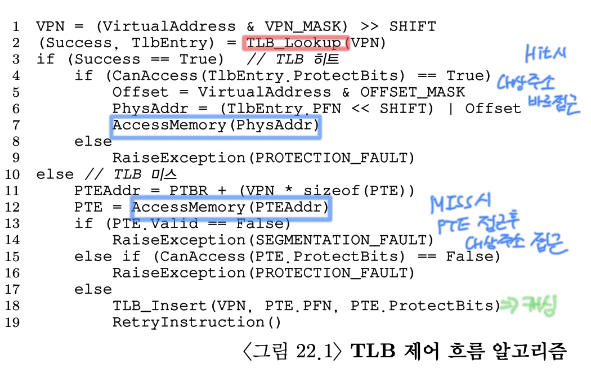

# 22. 페이징: 더 빠른 변환(TLB)
#OS/OSTEP/이론/가상화

페이징에서 매핑 정보를 저장하기 위해선 큰 메모리 공간이 요구된다. 가상 주소를 물리 주소로 변환하기 위해선 메모리에 있는 페이지 테이블의 매핑 정보를 읽어야 하고, **엄청난 성능 저하를 유발한다.** 모든 로드/스토어 명령어 실행은 추가적인 메모리 읽기가 필요하므로, 성능 저하는 매우 심해진다.

그렇다면, 주소 변환을 어떻가 빨리할 수 있을까? 
-> 메모리 접근을 피해야 하는데? -> 어떻게? -> 메모리 말고 빠른 하드웨어로? -> 운영체제는 어떻게 개입해야 할까?

운영체제의 실행 속도 개선을 위해선 대부분 하드웨어의 도움을 받는다. 주소 변환을 위해서 **변환 -색인 버퍼(translation-lookaside buffer, TLB)**를 도입한다. 
- TLB는 칩의 메모리 관리부(**MMU**)의 일부이다.
- 자주 참조되는 가상 주소-실주소 변환 정보를 저장하는 하드웨어 **캐시**이다. **(주소-변환 캐시)**

가상 메모리 참조 시, 하드웨어는 먼저 TLB에 원하는 변환 정보가 있는지 확인하고 있다면 페이지 테이블을 통하지 않고 변환을 빠르게 수행한다. 실질적으로 TLB는 **페이징 성능을 엄청나게 향상시킨다.**

## 22.1 TLB의 기본 알고리즘
<!-- {"width":596} -->
1. 가상 주소에서 가상 페이지 번호(VPN)을 추출한다.
2. 해당 VPN의 TLB 존재 여부를 검사한다. (존재하면 TLB HIT, 없으면 TLB MISS)

**TLB HIT의 경우**
1. TLB 항목에서 페이지 프레임 번호(PFN)을 추출할 수 있다.
2. 가상 주소의 오프셋과 PFN을 조합하여 물리주소(PA)를 구성하고 메모리에 접근할 수 있다.

**TLB MISS의 경우**
1. 페이지 테이블에 접근하여 가상 메모리 참조가 유효한지 확인한다.
2. 접근 가능하다면 해당 변환 정보를 TLB로 읽어들인다. (매우 시간 소요가 많이 된다.)
3. TLB가 갱신되면 하드웨어는 명령어를 재실행한다.
4. TLB에 변환 정보가 존재함으로, 메모리 참조가 빠르게 처리된다.

모든 **캐시 설계의 철학**은, “**대부분의 경우 캐시에 있다**” 라는 가정을 전제로 만든다. TLB의 주소 변환도 마찬가지다.
**TLB**는 프로세싱 코어와 가까운 곳에 위치하고 매우 빠른 하드웨어로 구성되기 때문에 **주소 변환 작업은 부담스러운 작업이 아니다.**
다만, 미스가 발생하면 메모리 참조로 인해 페이징 비용이 커진다. **TLB 미스가 발생하는 경우를 최대한 피해야 한다.** 

## 22.2 예제: 배열 접근
예제를 통해 TLB 작동 과정을 알아보자. 
<!-- {"width":405} -->
- 배열 `a[]`는 100번지부터 10개의 4바이트 크기의 정수 배열이다.
- 가상 주소 공간은 8비트(정확히는 주소값이 8비트), 페이지 크기는 16바이트이다.
  - offset비트는 4비트, 나머지 4비트는 VPN(16개의 가상 페이지 표현)

위 예제에서, 배열의 첫 항목 `a[0]`는 `VPN=06, 오프셋 04`에서 시작한다. 세 개의 4바이트 정수가 페이지에 들어간다.
다음 페이지에는 `a[3]….a[6]`이 들어가고, 다음 페이지에는 마지막 세 개의 항목 `a[7], a[8], a[9]`가 들어간다.

이 배열의 원소의 합을 구하는 코드의 실행을 생각해보자.
```c
int sum = 0;
for (int i = 0; i < 10; i++) {
	sum += a[i];
}
```

정수 배열에 대한 메모리 접근만 살펴보자. 
- 첫 번째 배열의 항목 `a[0]` -> (가상 주소 100번) -> 하드웨어가 VPN 추출하여 06번 확인 -> TLB에서 VPN 검색 -> **미스**
  - VPN 06번에 대한 물리 페이지 번호를 찾아 TLB를 갱신한다.
- `a[1]` -> **TLB 히트**
  - **배열의 두 번째 항목은 첫 번째 항목과 같은 페이지에 존재하기 때문이다.**
  - 첫 번째 항목을 읽을 때 해당 페이지를 접근하였기 때문에 필요한 변환 정보가 이미 TLB에 탑재되어 있다.
- `a[2]` -> **TLB 히트**
- `a[3]` -> **TLB 미스**
- `a[4], a[5], a[6]` -> **TLB 히트** 
- …

> [!CAUTION] 하드웨어가 데이터를 읽어들일 때 페이지 단위로 읽는다?
> **페이지는 “주소 변환의 단위”이다. 데이터의 크기가 아니다.** 
> “첫 번째 항목을 읽을 때 필요한 변환 정보가 이미 TLB에 있다”는 말은 **캐시 라인 때문이 아니라,**
> **TLB가 VPN → PFN 변환을 ‘페이지 단위’로 저장하기 때문이다.**
> **TLB 캐시와 데이터 캐시는 완전히 별개의 개념이다.** TLB는 *주소 변환 정보*를 페이지 단위로 저장하고, 데이터 캐시는 *실제 데이터*를 저장한다. 구체적으로, 데이터 캐시는 위 예제의 메모리에 있는 배열의 구체적인 값을 캐시 라인 단위로 저장한다.

> [!TIP] 왜 TLB는 페이지 단위로 주소 변환 정보를 저장할까?
> 가상 메모리 시스템에서 주소는 `[VPN | OFFSET]` 이렇게 고정 분해된다. 핵심은, offset은 변환 과정에서 절대로 바뀌지 않는다. 캐시할 가치가 있는 정보는 `VPN → PFN`이다. 이 정보 자체가 페이지 단위이므로, 페이지 단위로 캐싱한다.

히트 횟수를 총 접근 횟수로 나누어 얻은 **TLB 히트 비율**은 70%가 된다. (어느 정도는 된다.)
배열이 처음으로 접근되어도, TLB의 **공간 지역성(spatial locality)**로 인해 성능을 개선할 수 있다. 항목들이 **페이지 내에서 서로 인접**해 있기 때문에 페이지에서 첫 번째 항목을 접근할 때만 TLB 미스가 발생한다.

위 예제에서 만약 루프를 한 번더 돈다면, 모든 주소 변환 정보가 TLB에 탑재되어 성능은 더욱 개선될 것이다. 모드 히트된다.
이 경우에는 **시간 지역성(temporal locality)**으로 인해 TLB의 히트율이 높아진다. 
- **시간 지역성**이란 한번 참조된 메모리 영역이 짧은 **시간** 내에 재 참조되는 현상을 일컫는다.

다른 캐시와 마찬가지로, TLB의 성공 여부는 프로그램의 공간 지역성과 시간 지역성 존재 여부에 달려있다.

> [!TIP] 가능하면 캐싱을 사용하자.
> 캐싱은 “일반적인 경우를 빠르게” 하기 위해 오랜 시간 적용되어온 방법이다. 하드웨어 캐시 사용의 근본 취지는 **지역성(locality)**을 활용하는 것이다. 
> - 시간 지역성은 최근에 접근된 명령어 또는 데이터는 곧 다시 접근될 확률이 높다는 사실에 근거한다. 
>   - ex. for/while 문
> - 공간 지역성은 프로그램이 메모리 주소 x를 읽거나 쓰면 x와 인접한 메모리 주소를 접근할 확률이 높다는 사실에 근거한다.
>   - ex. 순차 배열
> 프로그램이 시간 지역성/공간 지역성을 내재하는지는 명확히 판단할 수 없다. 대충 판단할 수 밖에 없다.
> 하드웨어 캐시의 목적은 메모리 내용을 매우 빠른 CPU 칩 내의 메모리에 위치시키고, 접근 지역성을 최대한 활용하는 것이다. **명령어 캐시, 데이터 캐시, 주소 변환 캐시 등 모든 하드웨어 캐시에 적용된다.**
> 초대용량 캐시를 제적할 수 없는 이유는, 빠르게 하려면 크기가 작아야하는데 크게 만들면 느려지기 때문이다.

## 22.3 TLB 미스는 누가 처리할까
TLB 미스처리는 HW/SW 두 가지 처리 방법이 있다. 
**CISC** 구조 시절에는 하드웨어 엔지니어들이 OS 개발자를 신뢰하지 못해 TLB 미스를 하드웨어가 처리하도록 설계했다. 이를 위해선 하드웨어가 페이지 테이블에 대한 명확한 정보를 가지고 있어야 한다. **(page-table base register)**
- 인텔 x86 CPU가 하드웨어로 관리되는 TLB의 대표적인 예시이다. x86 CPU는 **멀티 레벨 페이지 테이블**을 사용한다.

RISC는 **소프트웨어 관리 TLB**를 사용한다. TLB에서 주소 찾는 것이 실패하면, 하드웨어는 예외 시그널을 발생시킨다. 예외 시그널을 받은 운영체제는 명령어 실행을 잠정 중지하고, 커널모드로 전환하여 TLB 미스 처리를 담당하는 **트랩 핸들러**를 실행한다. 
- 이 트랩 핸들러는 페이지 테이블을 검색하여 변환 정보를 찾고, TLB 접근이 가능한 특권 명령어로 TLB를 갱신하고 리턴한다.
- 리턴되면 하드웨어가 명령어를 재실행한다. -> TLB 히트

**소프트웨어 관리 TLB**에선 두 가지 중요한 사항이 있다.
1. 시스템 콜에선, 트랩 핸들러 리턴 후 **다음** 명령어를 실행한다. TLB 미스의 경우, 트랩을 발생시킨 명령을 **다시** 실행한다. 이 때, 트랩이 발생하면 다시 실행을 계속해야할 명령어 주소(PC) 값을 알아야하므로, **PC 값을 저장**한다.
   - 여기서 알 수 있는건, 트랩 발생의 원인에 따라 현재 명령어의 PC값 혹은 다음 명령어의 PC값을 저장해야 한다.
2. TLB 미스 핸들러를 실행할 때, TLB 미스가 무한 반복되지 않도록 주의해야 한다.TLB 미스 핸들러에 접근할 때 TLB 미스가 나면 안 된다. 
   - 이를 해결하기 위해 다양한 방법이 있다. 
   - ex) TLB 미스 핸들러를 물리 메모리에 위치시킴. 주소를 ‘물리’ 주소로 표시하는 것이다. **unmap되어** 있으므로 주소 변환이 필요 없다.
   - ex) TLB의 일부를 핸들러 코드 주소를 저장하는데 영구히 할당한다. TLB 핸들러는 항상 히트된다. 이를 **연결(wired)** 변환이라 한다.

**소프트웨어 관리 TLB** 방식의 주된 장점은 **유연성**과 **단순함**이다. 하드웨어 변경 없이 페이지 테이블 구조를 자유롭게 바꿀 수 있고, TLB 미스시 하드웨어는 별로 할 일이 없다. 단순하다.

## 22.4 TLB의 구성: 무엇이 있나?
일반적으로 TLB는 32, 64, 128개의 엔트리를 가지며, **완전 연관(fully associative)** 방식으로 설계된다. 
완전 연관 방식에서 변환 정보는 TLB 내에 어디든 위치할 수 있으며, 변환 정보를 찾는 검색은 TLB 전체에서 병렬적으로 수행된다.

TLB 항목에서는 VPN, PFN을 제외하고 valid bit, protection bit, 주소 공간 식별자, dirty bit… 등의 비트가 있다.

## 22.5 TLB의 문제: 문맥 교환
TLB 또한 저장소이고, 프로세스 간 문맥 교환 시 새로운 문제가 발생한다. 변환 정보는 해당 프로세스에서만 유효하다. 새로운 프로세스에서는 이전에 실행하던 프로세스의 변환 정보를 사용하지 않도록 해야 한다.

하나의 프로세스 P1이 실행 중이고, TLB가 P1에 유효한 변환 정보를 캐싱하고 있다고 가정하자. (VPN 10 -> PFN 100) 또한, 프로세스 P2가 있고, 운영체제가 컨텍스트 스위칭을 수행하기로 결정하여 P2를 실행시키려고 한다고 해보자. (VPN10 -> PFN 170)

<!-- {"width":296} -->
- VPN 10에 대한 변환 정보가 두 개 존재한다.
- 각 항목이 어떤 프로세스를 위한 변환 정보인 지 알 수 있는 방법이 없다.
- 정확하고 효율적으로 멀티 프로세스 간의 가상화를 지원해야 하기 위한 추가적인 기능이 필요하다.

> 나는 여기서 3 가지를 생각했다.
> 1. 통째로 리셋하기
> 2. PID 식별자 사용해서 덧붙이기
> 3. PID 식별자 사용하는데, 겹치면 덮어쓰기

한 가지 방법은 문맥 교환을 수행할 때 다음 프로세스가 실행되기 전에 기존 TLB 내용을 비우는 것이다. 
둘 중 어느 경우든 모든 valid bit을 0으로 설정하는 과정을 거친다.

컨텍스트 스위칭을 할 때 마다 TLB를 비우면, 잘못된 변환 정보를 사용하는 상황을 방지할 수 있다. 하지만 이 방식을 사용하면 새로운 프로세스 실행할 때 마다 TLB 미스가 발생하게 된다. 컨텍스트 스위칭이 자주 발생하면 이는 성능에 큰 부담이 된다.

몇몇 시스템에선 문맥 교환이 발생하더라도 TLB의 내용을 보존할 수 있는 HW 기능을 추가하였다. TLB 내에 **주소 공간 식별자(address space identifier, ASID)**를 추가하는 것이다. 
- ASID는 PID와 유사하나, 더 적은 비트를 가지고 있다.
<!-- {"width":469} -->
- ASID를 추가함으로써 프로세스들이 TLB 공간을 공유할 수 있게 되었다.

ASID를 사용하면 **프로세스별로 TLB 변환 정보를 구분**할 수 있게 된다. 올바른 주소 변환을 위해선 **HW는 현재 어떤 프로세스가 실행 중인이 파악**해야 한다.(여러 개가 있으니까) 컨텍스트 스위칭 시, **운영체제**는 새로운 **ASID** 값을 **정해진 레지스터**에 탑재한다.


<!-- {"width":462} -->
- 위 예시에서는 두 개의 다른 VPN을 갖는 두 개의 다른 프로세스들의 두 항목이 동일한 물리 페이지를 가리키고 있다.
- 이런 경우는 두 개의 프로세스들이 하나의 페이지(ex. 코드 페이지)를 공유하고 있을 때 발생할 수 있다.
- 코드 페이지를 공유하면 물리 페이지 수가 줄어들어 유용하다.

## 22.6 이슈: 교체 정책
모든 캐시와 마찬가지로, TLB에서도 **캐시 교체** 정책이 매우 중요하다. 새로운 항목을 탑재할 때 현재 존재하는 항목 중 하나를 **교체** 대상으로 선정해야 한다.

항목 교체에 대한 기준이 필요하다. 목표는, **미스율을 줄여(=히트 비율을 증가시켜) 성능을 개선**하는 것이다.

(자세한 건 여기서 안다룸)
한 가지 흔한 방법은 **최저 사용 빈도(least-recently-used, LRU)**로 메모리 참조 패턴에서 **지역성**을 최대한 활용하는 것이 목적이다. 사용되지 않은 오래된 항목일수록, 앞으로 사용될 가능성이 작아 적합하다는 근거이다.
또 다른 방법은 랜덤 정책이다. 교체 대상을 무작위로 정한다. 구현이 간단하고 예상치 못한 예외 상황 발생을 피할 수 있다.

LRU는 합리적인 것처럼 보이지만 최악의 경우 모든 접근에 대해 미스를 유발한다. 예를 들어, TLB는 n개의 변환 정보를 저장할 수 있고 TLB가 n + 1 페이지들에 대해 반복문을 수행하면 최악의 경우 모든 접근에 미스를 유발한다. (n + 1 개 중에서 TLB에 있는 n개를 제외한 1개에 계속 접근)

## 22.7 실제 TLB
<!-- {"width":697} -->
MIPS의 소프트웨어 관리 기반 TLB이다.
- 32비트 주소 공간, 4KB
- VPN은 20비트가 아니라 19비트이다. 절반은 사용자 주소 공간, 절반은 커널이 사용한다.
- 물리 프레임 번호로 24비트가 할당되어 있다. 64GB 주 메모리 지원이 가능하다.
- 전역 비트 (G, global)는 프로세스간 공유되는 페이지들을 위해 사용된다.
  - 전역 비트가 설정되어 있으면 주소 공간들을 서로 구분한다.
- 8비트의 ASID 필드가 있다.
  - 만약 동시에 256개 이상의 프로세스들이 동시에 실행된다면 어떻게 될까?
    - 내 생각엔, LRU로 TLB 제거?
    - GPT 피셜: 오래 쓰지 않은 ASID 하나를 선택하여 새 프로세스에 재할당하고, 기존 ASID에 대해 **TLB 엔트리 전체 무효화**한다. (충돌 위험) 또는 TLB 전체를 flush한다.
- 3비트의 일관성(coherence, C) 비트가 있다. 이 비트를 보고 페이지가 하드웨어에 어떻게 캐시되어 있는지 판별한다.
- dirty bit는 페이지가 갱신되면 세팅된다.
- valid bit는 항목에 유효한 변환 정보가 존재하는지 나타낸다.
- page mask는 여러 개의 페이지 크기를 지우너할 때 사용된다.
- 회색 처리된 64번째 비트는 사용하지 않는다.

MIPS TLB들은 일반적으로 32/64개의 항목으로 구성된다. 대부분은 사용자 프로세스들이 사용하고, 몇 개는 OS에 예약되어 있다. OS에 의해 연결된 레지스터가 설정되어 있을 수 있고, OS는 몇 개의 TLB를 예약할 지 하드웨어에 알린다. (ex. TLB 미스 핸들러)

MIPS의 TLB는 소프트웨어가 관리하므로, TLB 갱신을 위한 네 개의 명렁어를 제공한다.
- TLBP: 특정 변환 정보 탐색
- TLBR: TLB 항목을 레지스터로
- TLBWI: 특정 TLB 항목을 교체
- TLBWR: 임의의 TLB 항목 교체
- 4개 모두 특권이 있어야 한다.

칩상의 TLB를 주소 변환 캐시로 사용하여 대부분의 메모리 참조를 메인 메모리 상의 페이지 테이블을 읽지 않고 처리가 가능해졌다. TLB의 사용으로 일반적인 경우에 프로그램은 메모리 가상화 기능이 없는 것과 동일한 성능을 보일 것이기 때문에 현대 페이징 시스템에서 필수 요소이다.

> 생각을 해보자. 멀티프로그래밍을 위해 가상화를 했다. 페이징을 통해 단편화 이런 걸 최대한 해결하려고 했고, 남은 건 가상화 시 발생하는 **추가적인 메모리 접근**을 **해결하**는 것이었다. 추가적인 메모리 접근을 줄이기 위해 TLB 캐시를 사용했으므로, 일반적인 경우에 프로그램은 메모리 가상화 기능이 없는 것과 동일한 성능을 보이게 된다.

하지만, TLB가 모든 프로그램에서 항상 제대로 동작하는 건 아니다. 짧은 시간 동안 접근하는 페이지들의 수가 TLB에 들어갈 수 있는 수보다 많다면 많은 수의 TLB 미스가 발생하고 느려지게 된다. **TLB coverage**를 벗어난다고 표현한다. 
- 페이지 크기를 키우면 TLB 유효 범위가 늘어날 수 있다.
- DBMS에서 큰 페이지 지원을 한다.

CPU 파이프라인에서 TLB 접근 자체가 병목이 될 수 있다. **물리적으로 인덱스된 캐시**의 경우, 주소 변환이 캐시 접근 이전에 이루어져야 하는데 이 경우 상당히 느려질 수 있다. 가상 캐시로 접근하는 다양한 방법들이 고안되었으며, 캐시 히트가 발생한 경우 비싼 변환을 하지 않도록 하였다. **가상적으로 인덱스된 캐시(virtually indexed cache)**는 일부 성능 문제를 해결하지만 새로운 하드웨어 설계 문제를 가져온다.

----
## 물리적으로 인덱스된 캐시 vs 가상적으로 인덱스된 캐시
### 1. 캐시는 두 단계를 가진다
캐시 접근은 개념적으로 두 가지를 한다.

1. **인덱싱(indexing)**
   → 캐시의 *어느 세트/라인*을 볼지 고른다.
2. **태그 비교(tag check)**
   → 그 라인에 들어 있는 데이터가 *원하는 주소의 데이터가 맞는지* 확인한다.

여기서 중요한 질문이 생긴다.

> 이때 쓰는 주소가 **가상 주소냐, 물리 주소냐**?

### 2. 물리적으로 인덱스된 캐시 (Physically Indexed Cache)
**물리 주소(PA)**를 사용해서 캐시를 접근하는 방식이다.

### 동작 순서
1. CPU가 가상 주소(VA)를 만든다.
2. **TLB로 주소 변환을 먼저 수행**하여 물리 주소(PA)를 얻는다.
3. 그 **물리 주소의 일부 비트로 캐시를 인덱싱**한다.
4. 태그도 물리 주소 기반으로 비교한다.

즉,

> **주소 변환 → 캐시 접근**

이라는 순서를 반드시 따른다.

### 3. 왜 “병목”이 될 수 있는가
TLB가 아무리 빠른 하드웨어 캐시여도,
**캐시 접근 전에 반드시 TLB를 거쳐야** 한다.

* TLB hit → 그나마 빠름
* TLB miss → 페이지 테이블 접근 + 트랩 → 매우 느림

따라서 물리적으로 인덱스된 캐시에서는
> **캐시 hit라도, TLB 접근 비용은 항상 먼저 지불**

해야 한다.
이 때문에 책에서 말한 것처럼,

> “CPU 파이프라인에서 TLB 접근 자체가 병목이 될 수 있다”
> 라는 말이 나오는 것이다.

### 4. 왜 이런 방식을 쓰는가

물리적으로 인덱스된 캐시는 **단순하고 안전**하다.

* 서로 다른 가상 주소가 같은 물리 페이지를 가리키는 경우에도
  * 같은 물리 주소 → 같은 캐시 라인
* 프로세스가 바뀌어도
  * 물리 주소 기준이므로 캐시 오염 문제가 없다

즉,
* **alias 문제 없음**
* **문맥 교환 시 캐시 flush 필요 없음**
  이라는 장점이 있다.

### 5. 새로운 아이디어
> “**캐시 접근을 주소 변환보다 먼저 할 수는 없을까?**”

### 6. 가상적으로 인덱스된 캐시 (Virtually Indexed Cache)
**가상 주소(VA)**를 사용해서 캐시를 인덱싱하는 방식이다.
* CPU는 처음에 **가상 주소를 항상 가지고 있다**.
* 그렇다면:
  * 캐시 인덱싱을 가상 주소로 먼저 하고
  * 동시에 TLB에서 주소 변환을 수행하면 된다.

즉,
> **캐시 접근 ∥ TLB 변환 (병렬)**

을 노린 구조이다.
### 7. 동작 흐름
1. CPU가 가상 주소(VA)를 생성한다.
2. 가상 주소의 일부 비트로 **캐시 인덱싱을 즉시 시작**한다.
3. 동시에 TLB에서 VPN → PFN 변환을 수행한다.
4. 변환이 끝나면
   * 얻어진 물리 주소로 **태그를 확인**한다.
5. 태그가 맞으면 캐시 hit, 아니면 miss이다.

중요한 점은,
* **인덱스는 가상 주소**
* **태그 검증은 물리 주소**

라는 점이다.
### 8. 왜 “빠를 수 있는가”
이 구조에서는
* 캐시 인덱싱 시간
* TLB 접근 시간
이 **겹쳐서 진행**된다.

따라서 TLB hit의 경우,
> 캐시 hit 경로에서
> **주소 변환 비용이 거의 숨겨진다**

이게 책에서 말한
> “캐시 hit가 발생한 경우 비싼 변환을 하지 않도록 하였다”
> 의 의미이다.

### 9. 하지만 새로운 문제가 생긴다
가상 주소를 쓰기 때문에 **본질적인 위험**이 생긴다.

**(1) alias 문제**
* 서로 다른 가상 주소가
* 같은 물리 페이지를 가리킬 수 있다.

이 경우,
* 같은 물리 데이터가
* **캐시의 서로 다른 위치에 중복 저장**될 수 있다.
→ 데이터 불일치, 일관성 문제 발생 가능.

**(2) 문맥 교환 문제**
* 가상 주소는 프로세스마다 의미가 다르다.
* 다른 프로세스가 같은 가상 주소를 쓰면
  * 캐시 충돌 가능성이 생긴다.

→ 단순히 두면 오동작 위험이 있다.
### 10. 그래서 나온 절충: “가상적으로 인덱스된”
책에서 조심스럽게 표현하는 이유가 여기 있다.

* 완전히 가상 주소만 쓰는 캐시는 위험하다.
* 그래서 **인덱싱만 가상 주소로** 하고,
* **정합성 확인은 물리 주소 기반**으로 한다.

즉,
* **속도**를 위해 가상을 쓰되
* **정확성**은 물리 주소로 지키려는 구조이다.
---

## 구현 코드 실행 결과
```
==============================
22.2 Array Access (single pass) - TLB HIT/MISS trace
==============================
VA_BITS=8, PAGE_SIZE=16B (OFFSET_BITS=4)
a[] base VA=100, len=10, elemSize=4B
a[0] VA=100 (VPN= 6, OFF= 4) -> MISS PFN=  1 -> PA= 20
a[1] VA=104 (VPN= 6, OFF= 8) -> HIT  PFN=  1 -> PA= 24
a[2] VA=108 (VPN= 6, OFF=12) -> HIT  PFN=  1 -> PA= 28
a[3] VA=112 (VPN= 7, OFF= 0) -> MISS PFN=  2 -> PA= 32
a[4] VA=116 (VPN= 7, OFF= 4) -> HIT  PFN=  2 -> PA= 36
a[5] VA=120 (VPN= 7, OFF= 8) -> HIT  PFN=  2 -> PA= 40
a[6] VA=124 (VPN= 7, OFF=12) -> HIT  PFN=  2 -> PA= 44
a[7] VA=128 (VPN= 8, OFF= 0) -> MISS PFN=  3 -> PA= 48
a[8] VA=132 (VPN= 8, OFF= 4) -> HIT  PFN=  3 -> PA= 52
a[9] VA=136 (VPN= 8, OFF= 8) -> HIT  PFN=  3 -> PA= 56
TLB stats (after 1 pass): hits=10, misses=3, hitRate=76.92%

==============================
Temporal locality demo (2 passes)
==============================
[PASS 1]
[PASS 2] (temporal locality 기대: 더 많은 HIT)
TLB stats (after 2 passes total): hits=30, misses=3, hitRate=90.91%

==============================
Context Switch Demo (useAsid=false, flushOnSwitch=false)
==============================
P1 access VA=163 (VPN=10) -> MISS PFN=100 PA=1603
P2 access VA=163 (VPN=10) -> HIT  PFN=100 PA=1603
⚠️  STALE TRANSLATION! expected PFN=170 but got PFN=100 (문맥 교환 이슈)
TLB stats: hits=2, misses=1, hitRate=66.67%

==============================
Context Switch Demo (useAsid=false, flushOnSwitch=true)
==============================
P1 access VA=163 (VPN=10) -> MISS PFN=100 PA=1603
P2 access VA=163 (VPN=10) -> MISS PFN=170 PA=2723
TLB stats: hits=2, misses=2, hitRate=50.00%

==============================
Context Switch Demo (useAsid=true, flushOnSwitch=false)
==============================
P1 access VA=163 (VPN=10) -> MISS PFN=100 PA=1603
P2 access VA=163 (VPN=10) -> MISS PFN=170 PA=2723
TLB stats: hits=2, misses=2, hitRate=50.00%
```

# 깔끔하게 요약
## 목적
* 멀티프로그래밍을 위해 가상화를 도입했고, 페이징으로 단편화 문제를 완화했지만, 남는 핵심 비용은 **주소 변환 때문에 매번 추가로 발생하는 메모리 접근**이다.
* 목표는 이 추가 메모리 접근을 줄여, **일반적인 경우 프로그램이 가상화가 없는 것처럼 빠르게 동작**하게 만드는 것이다.

## 문제점
* 페이징에서 가상 주소 → 물리 주소 변환을 하려면 **메모리의 페이지 테이블을 읽어야** 한다.
* 모든 로드/스토어마다 페이지 테이블 접근이 끼어들면 **성능 저하가 매우 커지는 구조**이다.

## 해결: TLB로 주소 변환을 캐싱함
* TLB는 MMU 내부의 하드웨어 캐시이며, **자주 쓰는 VPN → PFN 변환**을 저장한다.
* 동작 흐름은 다음과 같다.
  * **TLB hit**: VPN→PFN을 즉시 얻고, 오프셋과 조합해 PA를 만들어 바로 메모리에 접근하는 구조이다.
  * **TLB miss**: 페이지 테이블을 조회해 변환을 찾고 TLB를 갱신한 뒤, **해당 명령을 재실행**하여 hit로 처리되게 만드는 구조이다.
* 효과는 지역성에 의해 나온다.
  * 같은 페이지 안에서 연속 접근이면 **첫 접근만 miss**이고 이후는 hit가 되는 경향이 있다(공간 지역성).
  * 같은 변환을 짧은 시간 내에 반복하면 **hit가 누적**되는 경향이 있다(시간 지역성).

## OS가 개입하는 지점
### 1) TLB miss 처리 주체의 선택
* 하드웨어 관리 방식에서는 하드웨어가 페이지 테이블을 직접 따라가며 miss를 처리하는 구조이다.
* 소프트웨어 관리 방식에서는 miss 시 예외가 발생하고, OS가 트랩 핸들러로 들어가 **페이지 테이블을 찾아 TLB를 갱신**한 뒤 복귀하는 구조이다.
  * 이때 TLB miss는 “다음 명령”이 아니라 **트랩을 일으킨 명령을 다시 실행**해야 하므로 PC 저장이 중요해지는 구조이다.
  * 트랩 핸들러 자체가 TLB miss를 또 내면 무한 반복이 되므로, 핸들러가 안정적으로 실행되게 하는 장치가 필요하다.
    * 핸들러를 물리 메모리에 두거나(unmap),
    * 일부 TLB 엔트리를 핸들러용으로 고정하는(wired) 방식이 쓰이는 구조이다.

### 2) 문맥 교환 문제와 ASID
* TLB 엔트리는 프로세스에 종속되므로, 문맥 교환 시 **이전 프로세스의 변환을 새 프로세스가 쓰면 오동작**하는 구조이다.
* 단순 해법은 문맥 교환 때마다 TLB를 비우는 방식이지만, 매번 cold miss가 나 성능 손해가 커지는 구조이다.
* 이를 줄이기 위해 TLB 엔트리에 **ASID를 붙여 프로세스별로 구분**하는 방식이 있고, 이때 OS는 문맥 교환 시 **현재 ASID를 레지스터에 적재**하는 역할을 맡는 구조이다.

## 남은 문제점
* **TLB coverage 한계**: 짧은 시간에 접근하는 페이지 수가 TLB 용량을 넘으면 miss가 급증해 느려지는 구조이다. (페이지 크기를 키우면 유효 범위가 늘 수 있다는 언급이 있다.)
* **교체 정책 이슈**: 새 엔트리를 넣기 위해 기존 엔트리를 교체해야 하며, LRU처럼 합리적으로 보여도 특정 패턴에서는 최악의 miss를 유발할 수 있는 구조이다. 랜덤은 단순하지만 예측 성능이 일정치 않은 구조이다.
* **파이프라인/캐시 설계와의 충돌**: TLB 접근 자체가 병목이 될 수 있고, 물리적으로 인덱스된 캐시는 변환이 캐시 접근 전에 필요해 비용이 커질 수 있는 구조이다. 이를 완화하려는 가상적으로 인덱스된 캐시는 성능 문제를 일부 줄이지만 다른 하드웨어 설계 문제를 동반하는 구조이다.
