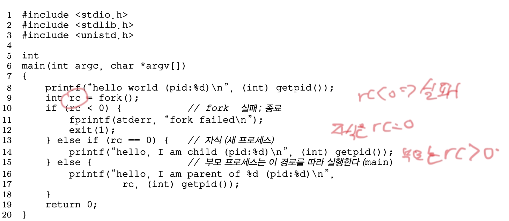

# 8. 프로세스 API
#OS/OSTEP/이론/가상화

UNIX 시스템의 프로세스 생성을 위한 `fork()`, `exec()` 시스템 콜을 다루고,
자신이 생성한 프로세스가 종료되기를 기다릴 때 사용하는 시스템 콜인 `wait()`를 다룬다.

## 8.1 fork() 시스템 콜
프로세스 생성에는 `fork()` 시스템 콜이 사용된다.

**예제) 프로그램 p1.c**

- `getpid()` : 현재 실행중인 프로세스의 식별자 조회

위 코드를 실행하는 프로세스는 `fork()` 시스템 콜을 호출한다. 프로세스 생성을 위해서이다.
여기서, **생성된 프로세스는 호출된 프로세스의 복사본이 된다.** 운영체제 입장에서는 프로그램 p1이 2개 존재하는 것이다.
- 새로 생성된 프로세스는 일반적으로 **자식** 프로세스라 부른다.
    - `fork()` 호출 이후 시작되었다.
- 생성한 프로세스는 **부모** 프로세스라 불린다.

**복사본이면 프로세스가 완전히 동일한가?** 아니다.
- 자식 프로세스는 자신의 주소 공간, 자신의 레지스터, 자신의 PC 값을 갖는다.
- (**중요!**) `fork()` 시스템 콜의 반환 값이 서로 다르다.
    - 부모 프로세스는 `fork()`로 부터 생성된 자식 프로세스의 PID를 반환받는다.
    - 자식 프로세스는 0을 반환받는다.

위 예제의 경우 `fork()` 이후 자식 프로세스와 부모 프로세스 중 어떤 것이 먼저 실행될 지 알 수 없다.
- 이는 CPU 스케줄러가 결정한다.
    - **비결정성**
    - 멀티 쓰레드 프로그램 실행 시 다양한 문제가 발생한다.

> [!NOTE] 자바에서 `thread.start()`를 실행하면 네이티브 코드를 거쳐 OS에서는 `fork()`를 실행할까?
> **OS에서** fork()**가 실행되는 것은 아닙니다.** JVM은 **네이티브 코드**를 통해 **OS 스레드**를 생성합니다.
> HotSpot JVM 기준으로는 pthread_create()(리눅스/유닉스) 또는 CreateThread()(윈도우) 같은 **OS 스레드 생성 API**를 호출합니다.
>
> **ex) Linux + HotSpot JVM에서 Thread.start() 실행 시:**
> * JVM → JNI(native) 레이어 → **pthread_create()** **호출**
> * pthread_create() → 커널의 **clone()** **시스템콜** 실행
> * clone()은 fork()와 달리 **주소 공간을 공유**하는 새로운 스레드를 생성합니다.
(CLONE_VM, CLONE_FILES 등의 플래그 설정)
    > 자바는 스레드 모델을 사용하기 때문에, 사실 `fork()`나 `wait()`를 네이티브 메서드를 통해 호출할 일도 거의 없다.

## wait() 시스템 콜
부모 프로세스가 자식 프로세스의 종료를 대기해야 하는 경우, `wait()` 시스템 콜 혹은 `waitpid()` 시스템 콜을 사용한다.
<!-- {"width":630} -->
- 부모 프로세스는 `wait()` 시스템 콜을 호출하여 자식 프로세스 종료 시점까지 자신의 실행을 잠시 중지시킨다.
- 자식 프로세스가 종료되면 `wait()`는 리턴한다.

## 8.3 exec() 시스템 콜
`exec()`도 프로세스 생성 관련 API다. `fork()`와는 어떤 차이가 있을까?
- `exec()`는 **자기 자신이 아닌 다른 프로그램을 실행**해야 할 때 사용한다.

단어의 개수를 세는 프로그램인 `wc` 프로그램을 실행하기 위해, `execvp()` 시스템 콜을 호출해보자.
<!-- {"width":630} -->
<!-- {"width":535} -->
**exec() 시스템 콜이 수행되는 과정**
- 실행 파일의 이름(ex. wc), 인자(ex. p3.c) 가 주어지면 해당 실행 파일의 코드와 정적 데이터를 읽어 들여 **현재 실행중인 프로세스의 코드 세그먼트와 정적 데이터 부분을 덮어 쓴다.**
- **힙과 스택 및 프로그램 다른 주소 공간들도 새로운 프로그램의 실행을 위해 다시 초기화된다.**
- 운영체제는 프로세스의 argv과 같은 인자를 전달하여 프로그램을 실행시킨다.
- **새로운 프로세스를 생성하는게 아니다.** 프로그램을 대체하는 것이다.
- `exec()` 시스템 콜이 성공하게 되면 p3.c는 절대로 리턴하지 않는다.

**자바에서 간접적으로 fork(), wait(), exec()를 사용하게 하려면?**
```java
Process p = new ProcessBuilder("ls", "-al").start();
int exitCode = p.waitFor();  // 여기!
```
- `new ProcessBuilder(...).start()`, `Runtime.exec(...)` 내부에서 `java.lang.UNIXProcess.forkAndExec(Native Method)` 이런 메서드를 호출한다.
- JVM 내부 네이티브에서 **OS의** wait()/waitpid() **시스템 콜을 사용**하게 유도할 수 있다.

## 8.4 왜, 이런 API를?
왜 `fork()`, `exec()`와 같은 인터페이스를 사용할까?
UNIX의 쉘을 구현하기 위해서는 `fork()`, `exec()`를 분리해야 하기 때문이다.
- 쉘이 `fork()`를 호출하고 `exec()`를 호출하기 전에 코드를 실행할 수 있다..?
    - 뭔말일까?
    - `fork()`는 현재 프로세스를 **복제**해서 자식 프로세스를 만든다. `exec()`는 현재 프로세스의 메모리 공간을 **새 프로그램으로 덮어쓴다**. 만약 fork()+exec()가 한 번에만 제공된다면, **새 프로그램 실행 전에 자식 프로세스에서 설정할 기회가 없다**는 문제가 생긴다.
    - "쉘이 fork()를 호출하고 exec()를 호출하기 전에 코드를 실행할 수 있다"는 말의 의미는, "실행 환경 세팅"을 할 수 있다는 뜻이다.
    - 즉, exec()로 프로그램을 덮어쓰기 전에 자식 프로세스 안에서 원하는 작업(파일 디스크립터 재배치, 환경 변수 설정, signal handler 설정 등)을 미리 해둘 수 있다는 거다.
    - 정리히자면, **fork() 시점과 exec() 시점이 분리되어 있기 때문에, 그 사이에 원하는 코드를 실행할 수 있다는 말이다.**

예를 들어보자.
1. 쉘에서 파일 시스템에서 실행 파일의 위치를 찾고 명령하기 위하여 `fork()`를 호출하여 새로운 자식 프로세스를 만든다.
2. `exec()`의 변형 중 하나를 호출하여 프로그램을 실행시킨다.
3. `wait()`을 호출하여 명령어가 끝나기를 기다린다.
4. `wait()`로 부터 리턴하고 다시 프롬프트를 출력하고 다음 명령어를 기다린다.
- 이 때, `fork()`와 `exec()` 를 분리함으로써 쉘은 많은 유용한 일을 쉽게할 수 있다.
    - `prompt> wc p3.c > newfile.txt`
    - **자식이 생성되고 호출되기 전에 표준 출력 파일을 닫고 newfile.txt 파일을 연다.**
    - wc의 출력은 화면이 아니라 파일로 보내준다.

아래 코드를 보자.
<!-- {"width":553} -->
- UNIX는 미사용중인 파일 디스크립터를 0번부터 찾아 나간다.
- 표준 출력 파일을 닫았기 때문에, `STDOUT_FILENO`가 첫 번째 사용 가능 파일 디스크립터로 탐색된다.
- 자식 프로세스가 표준 출력 파일 디스크립터를 대상으로 하는 모든 쓰기(ex. `printf()`)는 화면이 아니라 새로 열린 파일로 향하게 된다.
- `cat`을 해 보면 wc 실행 시 얻을 수 있는 모든 출력이 파일에 저장되어 있음을 확인할 수 있다.

UNIX 파이프도 유사하지만, `pipe()` 시스템 콜을 통해 생성된다. 한 프로세스의 출력과 다른 프로세스의 입력이 동일한 파이프에 연결된다. 명령어 체인이 형성되는 것이다.
- ex) `grep foo file | wc -l`

> 참고) 파일 디스크립터와 관련된 내용은 파일 시스템에 관하여 논의할 때 다룬다.

## 8.5 여타 API들
여기서 다른 것 외에도 많은 프로세스 관련 인터페이스가 있다.
- ex) `kill()` 시스템 콜은 프로세스에게 시그널을 보내는 데 사용된다.
    - 시그널은 프로세스를 중단(block)시키고 삭제하는 작업에 사용된다.
- ps 명령어(실행 중인 프로세스 조회), top 명령어(자원을 얼마나 사용중인지 조회) 등등

> [!NOTE] Q) 자바에서는 fork(), exec(), wait(), kill(), pipe() 같은 시스템 콜이 언제 발생하게 될까?
> 1. `fork()`, `exec()`
     >    - `new ProcessBuilder(...).start()`
>    - `Runtime.getRuntime().exec(...)`
>    - JVM 내부적으로는:
       >      1. fork()를 호출해서 현재 프로세스를 복제
>      2. 자식 프로세스 쪽에서 execve()를 호출해 원하는 명령 실행
> 2. `wait()` (주의! 자바의 `Object.wait()` 과는 다름!!!)
     >    - 자바에서 외부 프로세스 종료를 기다릴 때 발생:
            >      - `Process.waitFor()`
>      - JVM은 내부적으로 waitpid()를 호출해서 자식 프로세스의 종료 상태를 수집한다.
> 3. `kill()`
     >    - 자바에서 **프로세스 종료**를 요청할 때 발생:
            >      - `Process.destroy()` → 보통 SIGTERM
>      - `Process.destroyForcibly()` → SIGKILL
> 4. `pipe()`
     >    - 자바에서 **프로세스 간 통신**을 설정할 때 발생:
            >      - `ProcessBuilder.redirectOutput(...)`
>      - `Process.getInputStream(), getOutputStream()`
>    - JVM은 자식 프로세스와 통신하기 위해 **익명 파이프**(pipe())를 열고, 표준 입출력에 연결한다.
>    - 내부적으로 `pipe()`, `dup2()` 같은 시스템 콜이 연달아 호출된다.

> [!NOTE] VM 내부에서 **Object.wait()/notify()** 같은 동기화 관련 동작이 **어떤 OS syscall로 매핑**될까?
> 자바의 스레드는 OS 스레드(1:1)와 매핑됨 → pthread_create() 등으로 생성.
동기화 API들은 커널 수준의 **futex**(Linux) 같은 시스템 콜을 이용.

**Thread**
| **자바 기능** | **내부 발생 시스템 콜** |
|:-:|:-:|
| Thread.start() | clone() (Linux), 내부적으로 pthread_create() |
| Thread.sleep() | nanosleep() |
| Object.wait() | futex() (Linux), pthread_cond_wait() |
| Object.notify()/notifyAll() | futex() (wake) |
| Thread.join() | 내부적으로 futex/pthread_join() |
**I/O**
| **자바 기능** | **내부 발생 시스템 콜** |
|:-:|:-:|
| FileInputStream, FileOutputStream | open(), read(), write(), close() |
| Socket | socket(), bind(), listen(), accept(), connect() |
| NIO (Selector) | epoll_wait()(Linux), kqueue()(BSD, macOS) |
- 자바는 직접 시스템 콜을 호출하지 않지만, **JVM이 네이티브 라이브러리를 통해 자동으로 발생**시킨다.
