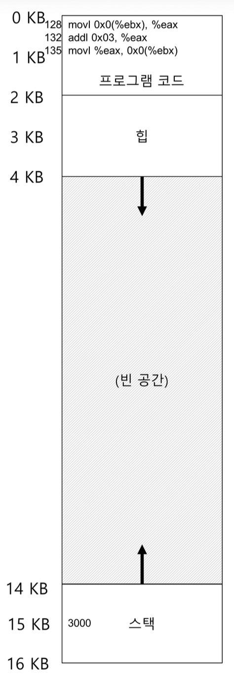

# 18. 주소 변환의 원리 - 동적 재배치
#OS/OSTEP/이론/가상화

## 18.0 주소 변환의 목표
CPU 가상화 파트에서 **LDE**에 대해 다뤘다. 메모리 가상화에서도 유사한 전략을 추구한다.
대부분의 경우 **하드웨어에서 직접 실행되고(효율성)**, 특정 순간에 필요한 경우에만 **운영체제가 개입(제어)**하여 문제가 발생하지 않도록 한다.
- 메모리 가상화의 효율성을 위해선 레지스터, TLB, 페이지 테이블 등의 복잡한 하드웨어를 사용하게 된다.
- 제어를 통해서 응용 프로그램이 자기 자신의 메모리 이외에는 다른 메모리에 접근하지 못하도록 운영체제가 보장한다.
  또한 프로그래머가 원하는 대로 주소 공간을 사용하고, 프로그래밍하기 쉬운 시스템을 만들어야 한다.**(유연성)**

이번 챕터에서 다루는 기법은 **하드웨어-기반 주소 변환** 또는 짧게 **주소 변환**이라고 불리는 기법이다.
특별한 기법은 아니다. 기존 LDE에 부가적인 기능이 추가된 것이다. 주소 변환을 통해 하드웨어는 명령어 반입, 탑재, 저장 등의 **가상 주소를 실제 존재하는 물리 주소로 변환한다.** 하드웨어가 프로그램의 모든 메모리 참조를 실제 메모리 위치로 재지정하기 위해, **하드웨어가 주소를 변환한다.**

하드웨어만으로 주소 변환이 구현되면 좋겠지만, 그럴 수는 없다. 운영체제가 일부 관여한다.
운영체제는 메모리의 빈 공간과 사용 중인 공간을 추적하고, 메모리 사용을 제어하고 관리한다.

우리는 프로그램이 자신의 전용 메모리를 소유하고 그 안아 자신의 코드와 데이터가 있다는 환상을 만드는 것을 목표로 한다.

## 18.1 가정
1. 사용자 주소 공간은 물리 메모리에 연속적으로 배치되어야 한다고 가정한다.
2. 주소 공간의 크기가 너무 크지 않다고 가정한다. (주소 공간은 물리 메모리 크기보다 작다)
3. 각 주소 공간의 크기는 같다고 가정한다.

## 18.2 사례
<!-- {"width":221} --><!-- {"width":260} -->
프로그램 관점에서 **주소 공간**은 0 ~ 16KB이다. 프로그램이 생성하는 모든 메모리 참조는 이 범위 내에 있어야 한다.
OS는 프로세스를 0부터 시작하는 물리 메모리 주소가 아닌 다른 곳에 위치시키려고 한다. 그렇다면 **어떻게 프로세스 모르게** 다른 위치에 **재배치**할 수 있을까? (어떻게 환상을 제공할 수 있을까?)

> [!TIP] 개입은 강력하다.
> 우리가 가상화를 하려면, 가상 주소를 물리 주소로 변환하는 과정에 하드웨어가 **개입**해야 한다.
> 여기서 알아야 할 것은, **인터페이스를 잘 정의**하면 시스템의 여러 측면을 **개선**하기 위해 **개입**을 사용할 수 있다.
> 이러한 개입 방식은 클라이언트를 변경하지 않고 이루어지진다는 **투명성**을 챙길 수 있다.


## 18.3 동적(하드웨어-기반) 재배치
**하드웨어 기반 주소 변환(=동적 재배치, dynamic relocation)**의 동작에는  **베이스(base)**와 **바운드(bound, a.k.a 한계-limit)**라고 불리는 두 개의 레지스터가 필요하다. 베이스와 바운드를 통해 우리가 **원하는 위치에 주소 공간을 배치**할 수 있게 하고, 오직 **자신의 주소 공간에만 접근한다는 것을 보장**한다.

사용자 프로그램이 시작될 때 OS는 **프로그램이 탑재될 물리 메모리 위치**를 결정하고 **베이스 레지스터**를 그 주소로 지정한다.
프로그램은 주소 0에 탑재되는 것처럼 작성되고 컴파일되기 때문에(가상 주소), 이 가상 주소를 물리주소로 변환해줘야 한다.
**하드웨어는 베이스 레지스터의 값을 가상 주소에 더해 물리 주소를 생성해낸다.**
- `physical address = virtual address + base`

1. OS가 프로그램 실행 시점에 `base 레지스터 값`을 설정함
2. HW가 `base + 가상 주소`를 계산하여 `물리 주소`를 구한다.

만약 `128: movl 0x0(%EBX), % eax` 라는 명령어를 실행한다고 해보자.
- 프로그램 카운터(PC)는 128로 설정된다.
- 하드웨어가 명령어를 반입할 때, PC 값을 베이스 레지스터의 값(32KB)에 더해 32986이라는 물리 주소를 얻는다.
- 하드웨어는 해당 물리주소에서 명령어를 가져와 명령어의 실행을 시작한다.
    - 이 명령어가 가상주소 15KB에 어떤 값을 탑재하는 명령어라면, 이 15KB라는 주소를 프로세서가 받아 베이스 레지스터를 더하고, 그 결과(물리 주소) 값인 47KB에 원하는 내용을 탑재한다.

**주소 변환**이란 기술은 **가상 주소에서 물리 주소로의 변환**을 말한다. 하드웨어가 변환하고, 이 주소의 재배치는 실행 시점에 일어난다.
프로세스가 실행된 이후에도 주소 공간을 이동할 수 있기 때문에 동적 재배치라고 불린다.

> **소프트웨어 기반 재배치(정적 재배치)**
> 하드웨어가 주소 변환을 제공하기 이전에는 소프트웨어가 **로더**를 통해 실행 파일의 모든 주소를 원하는 물리 메모리 오프셋으로 변경했다. 예를 들어, 명령어가 1000번지로부터 레지스터에 값을 탑재하고, 프로그램 주소공간이 3000이라면 로더는 명령어의 모든 주소를 3000씩 이동한 주소로 **다시 작성한다.**
> 이 방식은 잘못된 주소를 생성할 수 있어 보호가 안되고, 한 번 배치되면 추후 주소 공간을 재배치하는 것이 어렵다는 문제가 있다.

> **“프로세스가 실행된 이후에도 주소 공간을 이동할 수 있다?"**
> - **정적 재배치**에선 프로그램을 메모리에 로드할 때 **주소 변환을 1회 수행**하기 때문에 바이너리 상에서 물리 주소가 고정된다. **실행 중에 주소를 계속 계산하지 않는다.**
    >   - 프로그램은 물리 메모리에서 절대 이동 불가하다.
> - **동적 재배치**에선 **실행 중**에 하드웨어가 `가상주소 -> 물리주소` **변환을 계속 수행**한다.
    >   - 주소 공간 위치는 load-time에 유연하게 배치 가능하다.
>
> 실행 도중에 base 레지스터를 바꾸어서 주소 공간을 옮긴다는 말은 아니다. 물론 동적 재배치에서 이론상으로는 가능하지만 실제 OS에선 이런 일이 발생하진 않는다.

### 바운드 레지스터
예를 들어, 주소 공간이 0~16KB인데 명령어가 17KB로 작성되어 있으면 범위 밖의 물리 주소로 변환되어 문제가 발생할 수 있다.

바운드 레지스터는 **보호**를 지원하기 위해 존재한다. 프로세서는 메모리 참조가 합법적인지 확인하기 위해 가상 주소가 바운드 안에 있는지 확인한다.
- 17KB는 주소 밖이네?

프로세스가 바운드보다 큰 가상 주소거나 음수인 가상 주소를 참조하면 CPU는 예외를 발생시키고 프로세스는 종료된다.
- 17KB는 주소 밖이므로 종료시켜!
- 바운드 레지스터를 통해 프로세스가 생성한 주소가 합법적이고 프로세스의 범위에 있다는 것을 확인한다.

**베이스와 바운드 레지스터**는 **CPU 칩 상에 존재**하는 하드웨어이다. 주소 변환에 도움을 주는 프로세서 일부를 **메모리 관리 장치(memory management unit, MMU)**라고 부르기도 한다.

#### **바운드 레지스터의 동작 방식**(2가지 중 1가지로 정의됨)
1. 바운드 레지스터에 주소 공간의 크기를 저장하고, 하드웨어는 가상 주소를 베이스 레지스터에 더하기 전에 먼저 바운드 레지스터와 비교한다.
    - DB로 따지면 limit 값을 비교하는거다.
2. 바운드 레지스터에 주소 공간의 마지막 물리 주소를 저장하고, 하드웨어는 먼저 베이스 레지스터를 더하고 그 결과가 바운드 안에 있는지 검사한다.
    - DB로 따지면 offset + limit 값을 비교하는 거다.

논리적으로 **보호**의 과정은 두 가지 모두 동일하지만, 레지스터에 어떤 값이 저장되냐의 차이가 있다. (책에선 전자의 방식을 가정한다)

## 18.4 하드웨어 지원: 요약
CPU LDE 파트에서 다룬 내용과 합쳐보자.

응용 프로그램은 **사용자 모드**에서 실행되고, **프로세서 상태 워드(processor status word) 레지스터의 한 비트**가 CPU의 현재 실행 모드(사용자 모드, 커널 모드)를 나타낸다. (인터럽트, 시스템 콜 발생 시 모드가 바뀜)

하드웨어는 베이스/바운드 레지스터를 제공하여 자체적으로 주소를 변환하고 검사한다.

또한, 하드웨어는 베이스와 바운드 레지스터의 값을 변경하는 명령어를 제공해야 한다.
- CPU가 컨텍스트 스위칭을 할 때, 베이스와 바운드 레지스터 값을 변경해야 하고 이 변경하는 명령어가 필요한거다.
- 특권 명령어로, 커널 모드에서만 레지스터 변경이 가능해야 한다.

마지막으로 **CPU**는 사용자 프로그램이 바운드를 벗어난 주소로 **불법적인 메모리 접근**을 시도한 상황에서 **예외**를 발생시킬 수 있어야 한다.
- 이 경우 CPU는 프로세스를 중지시키고 운영체제의 “바운드 벗어남” **예외 핸들러**가 실행되도록 조치해야 한다.
- 구체적인 동작은 OS 핸들러가 결정한다. (물론 프로세스를 종료시킬 확률이 매우 높다)
- 사용자 프로그램이 베이스/바운드 레지스터 값을 수정하려는 경우도 예외를 발생시키고 핸들러를 실행시켜야 한다.
- 몇 개의 추가적인 특권 명령어를 추가하여 핸들러들의 주소를 파악할 수 있어야 한다.

## 18.5 운영체제 이슈
하드웨어가 새로운 기능을 통해 **동적 재배치**를 지원하지만, **운영체제에도 새로운 이슈**가 생긴다.
간단하게 가상 메모리를 구현하려면 OS + HW의 결합이 필요하고, OS의 개입이 반드시 필요한 세 개의 시점이 존재한다.

### 18.5.1 주소 공간이 저장될 메모리 공간 찾기
> **자료 구조 - free list**
> 운영체제는 프로세스에게 메모리를 할당할 수 있도록 사용되지 않는 **물리 메모리 공간 리스트를 유지**한다. 이 자료구조를 free list라고 부른다.

프로세스가 생성될 때 운영체제는 주소 공간이 저장될 메모리 공간을 찾아 조치를 취해야 한다.
(현재 우리의 가정하에선, 운영체제가 쉽게 처리 가능하다.)
- 운영체제는 물리 메모리를 슬롯의 배열로 보고 각 슬롯의 사용여부를 관리한다.
- 새로운 프로세스가 생성되면 free list를 검색하여 새로운 주소 공간 할당에 필요한 영역을 찾는다. 그리고 이 영역을 사용 중이라고 표시한다.

### 18.5.2 메모리 회수
정상적으로든 강제로든 프로세스가 종료될 때, 프로세스가 사용하던 메모리를 회수하여 다른 프로세스나 운영체제가 사용할 수 있게 해야 한다. OS는 종료한 프로세스의 메모리를 free list에 넣고 연관된 자료구조를 모두 정리한다.

### 18.5.3 컨텍스트 스위칭
운영체제는 컨텍스트 스위칭을 할 때 베이스-바운드 레지스터값을 저장하고 복원해야 한다. (CPU에는 베이스/바운드 레지스터가 한 쌍밖에 없으므로)

운영체제는 메모리에 존재하는 **PCB(프로세스 구조체, 프로세스 제어 블록)**에 베이스/바운드 레지스터 값을 저장하고, 프로세스가 다시 시작할 때/처음 시작할 때 이 프로세스에 맞는 값으로 CPU의 베이스/바운드 레지스터 값을 설정해야 한다.

만약 어떤 프로세스가 중단된 상태라면, OS는 주소 공간을 다른 물리 위치로 복사하고 PCB의 베이스 레지스터 값을 새로운 위치로 변경시킬 수 있다. 물리 주소가 바꼈지만 그럼에도 프로그램은 새로운 위치에 데이터/명령어가 존재한다는 것을 인식하지 못한다.

### 18.5.4 핸들러
운영체제는 예외 핸들러 또는 호출될 함수를 제공해야 한다.
운영체제는 **부팅 시점**에 특권 명령어를 통해 **핸들러를 설치**시킨다.

**예시**


- 부팅 시점에 핸들러의 주소를 제공한다.
- 메모리 변환은 OS 개입 없이 HW-프로그램 간에 처리된다는 점을 볼 수 있다.
- 불법적인 주소를 탑재한 프로세스의 경우 운영체제가 개입하여 프로세스를 종료시키고 정리한다.

**LDE**의 접근 방식을 아직까지 잘 지키고 있다.

## 18.6 요약
가상 메모리 기법을 통해 **LDE를 확장**하였다. **하드웨어의 지원**을 통해 **효율성**을 챙기고, **OS의 개입**을 통해 **제어**할 수 있었다.
그리고 이 모든 과정은 **프로세스에게 투명한** 방식으로 이뤄졌다.

하지만 동적 재배치는 비효율적인 면이 있다. 예를 들어 사용자 프로그램이 32KB\~48KB를 사용한다고 해보자. 실제로는 16KB의 공간을 모두 사용하는 것이 아니다. 스택과 힙 영역 사이의 내부 공간이 사용되지 않아 낭비되고 있다. 단편화가 발생한다.
이런 유형의 낭비를 **내부 단변화(internal fragmentation)**이라고 한다.
<!-- {"width":731} -->
충분한 물리 메모리가 있다고 해도, 고정 크기의 슬롯에 주소 공간을 배치해야 하기 때문에 내부 단편화가 발생한다. 물리 이용률을 높이고 내부 단편화를 방지하기 위한 더 정교한 기법이 필요하다.

다음 챕터에선 base-bound를 일반화한 **세그멘테이션**이라고 부르는 정교한 기법을 다루게 된다.

## 구현 코드 실행 결과
```
[OS] create pid=1 base=0 limit=16

bound 초과 시도
Segmentation fault: pid=1, vaddr=16

물리 주소 재배치 시도
[OS] relocate pid=1 from 0 to 32
vaddr 0 = 42
vaddr 15 = 7
```
- 0~15 vaddr 이지만, 16으로 접근하는 경우 바운드 레지스터에 의해 예외 발생
- 프로세스 모르게 물리 주소를 재배치 하더라도 해당 주소의 값은 그대로 유지되어 있음

# 깔끔하게 요약
## 1. 동적 재배치, 주소 변환의 목적
동적 재배치(베이스/바운드 기반 주소 변환)의 핵심 목표는 다음과 같다.
1. **가상 메모리 환상 제공**
    * 각 프로세스가 **“내 메모리는 0번지부터 N까지 연속으로 있다”**라고 믿고 실행하도록 만드는 것이 목적이다.
        * 실제로 물리적으로 파편화되있더라고 연속적으로 있는 것처럼 보이게 해야 한다.
    * 즉, 프로그래머는 항상 0부터 시작하는 주소 공간을 사용하는 것처럼 생각하고 코딩할 수 있다.
2. **보호(Protection)**
    * 한 프로세스가 다른 프로세스나 커널 메모리를 **잘못 혹은 악의적으로 건드리지 못하게** 막는 것이 핵심이다.
    * 프로세스는 오직 자신의 주소 공간 범위 안에서만 메모리에 접근할 수 있어야 한다.
3. **효율성과 제어의 조화 (LDE 확장)**
    * 대부분의 메모리 접근은 **하드웨어가 직접 처리**해서 빠르게 수행되도록 하고,
    * 예외적인 상황(잘못된 주소 접근, 레지스터 변경 등)에만 **운영체제가 개입**하여 제어하는 구조를 유지하는 것이 목적이다.
    * CPU 가상화에서의 LDE 아이디어를 **메모리 가상화로 확장한 것**이라 할 수 있다.
4. **투명성과 유연성**
    * 프로세스는 자신이 물리 메모리 어디에 놓였는지 전혀 모른 채 실행된다.
    * 운영체제는 필요에 따라 프로세스 주소 공간을 **물리 메모리의 다른 위치로 옮길 수 있는 유연성**을 얻는다.
    * 이 모든 과정이 프로세스 입장에서는 **투명하게** 진행되는 것이 목표이다.
      ⠀
## 2. 기존에 있었던 문제점
동적 재배치/주소 변환이 도입되기 전에는 주로 **정적 재배치(소프트웨어 기반, 로더 방식)**에 의존했는데, 이 방식에는 다음과 같은 문제가 있었다.
1. **보호 부재**
    * 실행 파일의 주소를 로더가 한 번만 바꿔서 물리 주소로 고정해버리기 때문에,
    * 실행 중에는 별도의 검사 없이 그 물리 주소 그대로 사용하게 된다.
    * 그 결과, 잘못된 주소를 사용해도 **다른 프로세스 메모리나 커널 공간을 침범할 수 있는 위험**이 존재한다.
2. **재배치 불가능**
    * 주소 변환이 **로드 시점에 단 한 번** 이루어지고, 명령어·데이터 속 주소 자체가 물리 주소로 박혀버리기 때문에,
    * 프로그램이 실행 중인 동안에는 **주소 공간을 다른 물리 위치로 옮기기가 사실상 불가능**하다.
    * 메모리 압축(compaction)이나 레이아웃 최적화를 하고 싶어도 유연성이 거의 없다.
3. **OS 관점에서의 관리 난이도**
    * 운영체제가 “지금 이 프로세스의 주소 공간을 다른 곳으로 옮겨 메모리를 효율적으로 쓰자”라는 결정을 내릴 수 있는 수단이 없다.
    * 즉, **메모리 재배치에 대한 제어권이 부족**한 상태이다.

## 3. 동적 재배치가 이 문제를 해결하는 방식
### 3.1 하드웨어 측 해결: 베이스/바운드 + MMU
1. **베이스 레지스터 (base)**
    * OS가 프로세스를 물리 메모리의 어떤 시작 위치에 올릴지 결정한 뒤, 그 시작 주소를 **베이스 레지스터에 저장**한다.
    * 프로세스가 사용하는 모든 주소는 여전히 “0부터 시작하는 가상 주소”이지만,
    * 하드웨어(MMU)가 매 접근마다 물리 주소 = 베이스 + 가상 주소를 계산하여 **실제 물리 위치로 변환**한다.
2. **바운드 레지스터 (bound)**
    * 프로세스의 **합법적인 가상 주소 범위**(예: 0 ~ 16KB)를 정의하기 위해 사용된다.
    * 하드웨어가 메모리 접근을 할 때,
        * 가상 주소가 바운드보다 크거나, 음수 등 비정상적인 값이면
          → **예외를 발생**시키고, OS가 해당 프로세스를 종료시키는 등의 조치를 취한다.
    * 이를 통해 **프로세스가 자신의 주소 공간 밖으로 나가는 것을 하드웨어 차원에서 차단**한다.
3. **MMU + 모드 비트 + 특권 명령어**
    * 베이스/바운드 레지스터는 CPU 안의 **메모리 관리 장치(MMU)** 일부이다.
    * 이 레지스터 값을 바꾸는 명령어는 **커널 모드에서만 가능한 특권 명령어**이다.
    * 사용자 프로그램이 이를 변경하려 시도하면 예외가 발생하고 OS 핸들러가 호출된다.
    * 이렇게 하여 **주소 변환은 빠르게 하드웨어가 처리하면서도, 정책 결정은 OS가 통제하는 구조**를 만든다.

### 3.2 운영체제 측 해결: 관리와 개입이 필요한 시점들
1. **메모리 공간 할당/회수 (free list 관리)**
    * OS는 물리 메모리에서 **어디가 비어있는지에 대한 free list**를 유지한다.
    * 새 프로세스가 생성되면 free list에서 연속된 영역을 찾아 그 영역을 사용 중으로 표시하고, 그 시작 주소를 베이스에 넣는다.
    * 프로세스가 종료되면 해당 영역을 다시 free list에 반환한다.
    * 이로써 **어디에 어떤 주소 공간이 올라가 있는지 OS가 전체를 조망하고 관리**할 수 있다.
2. **컨텍스트 스위칭 시 레지스터 저장/복원**
    * CPU에는 베이스/바운드 레지스터가 한 쌍뿐이므로, 프로세스 전환마다 이 값들을 바꾸어야 한다.
    * OS는 각 프로세스의 **PCB(프로세스 제어 블록)**에 해당 프로세스의 베이스/바운드 값을 저장해둔다.
    * 스위칭 시:
        * 현재 프로세스의 베이스/바운드를 PCB에 저장하고
        * 새로 실행할 프로세스의 값을 PCB에서 꺼내 CPU 레지스터에 복구한다.
    * 이 과정을 통해 각 프로세스는 언제 실행되든 **자신에게 맞는 주소 변환 환경**을 보장받는다.
3. **예외 핸들러 설치 및 처리**
    * 부팅 시 OS는 **바운드 초과, 특권 위반 등과 관련된 예외 핸들러 주소를 등록**한다.
    * 이후 잘못된 주소 접근이 발생하면:
        * 하드웨어가 예외를 발생시키고
        * OS의 해당 핸들러가 호출되어 프로세스를 종료하거나, 로그를 남기거나, 리소스를 회수하는 등의 정리를 수행한다.
    * 이렇게 함으로써 **정상적인 메모리 접근은 OS 개입 없이 빠르게 처리**하면서,
**비정상적인 경우에만 OS가 개입하는 LDE 철학**을 그대로 유지한다.
      ⠀
## 4. 남은 문제점과 한계
동적 재배치는 “가상 주소 → 물리 주소” 변환과 보호 문제를 해결해 주지만, 여전히 다음과 같은 한계가 남아 있다.
1. **내부 단편화(internal fragmentation)**
    * 가정: 각 프로세스는 **연속된 물리 메모리 영역**을 통째로 하나의 슬롯처럼 할당받는다.
    * 예를 들어, 프로세스의 주소 공간이 0\~16KB라고 가정하고 이를 32KB\~48KB 같은 물리 구간에 올린다고 하자.
    * 실제로 코드/데이터/스택/힙이 그 16KB를 **빽빽하게 채우는 경우는 드물다**.
        * 스택과 힙 사이의 여유 공간처럼 **사용하지 않는 구간**이 반드시 생긴다.
    * 그럼에도 OS 입장에서는 “16KB짜리 한 덩어리 슬롯”으로 보고 통째로 예약해두었기 때문에,
→ 그 사이의 안 쓰는 공간은 **다른 프로세스가 전혀 사용할 수 없는 낭비된 영역**이 된다.
    * 이런 현상을 **내부 단편화**라고 부르며, 물리 메모리 이용률을 떨어뜨리는 주요 원인이다.

아래 2, 3 내용은 참고만하자. 책에 없는 내용임.
2. **참고) 연속 할당 가정의 비현실성**
    * 모든 프로세스의 주소 공간이 **물리 메모리에서 연속되어야 한다**는 가정은 시스템이 커질수록 부담이 커진다.
    * 여러 프로세스가 생성·종료를 반복하면, 물리 메모리에는 **여기저기 자투리 빈 공간**이 생기는데,
        * 각각은 작고 띄엄띄엄 있어서
        * 큰 프로세스 하나를 위해 “충분히 큰 연속 영역”을 찾기 어렵게 된다.
    * 이때는 메모리 압축(compaction)을 해야 하는데, 동적 재배치만으로는 여전히 **복사 비용이 크고 관리가 번거롭다**는 문제가 남아 있다.
3. **참고) 주소 공간 크기와 형태에 대한 단순 가정**
    * “주소 공간 크기가 물리 메모리보다 작고, 모든 프로세스의 크기가 비슷하다”는 가정에 기대고 있다.
    * 하지만 실제 시스템에서는:
        * 어떤 프로세스는 매우 큰 주소 공간을 요구하고
        * 어떤 프로세스는 매우 작은 영역만 사용하며
        * 코드/데이터/힙/스택이 **서로 다른 성장 방향과 패턴**을 가진다.
    * 동적 재배치만으로는 이런 다양한 패턴을 잘 활용하기 어렵고, **희소(sparse) 주소 공간**을 표현하기에도 부족하다.
      ⠀
## 5. 맺음말: 다음 기법으로의 다리
정리하면, **베이스/바운드 기반 동적 재배치**는 **연속 할당 + 고정 크기라는 제약** 때문에
* 내부 단편화가 발생하고
* 물리 메모리 이용률이 떨어지며
* 점점 커지고 복잡해지는 주소 공간을 유연하게 다루기 어렵다는 한계가 남는다.

이 남은 문제들을 해결하기 위해, 다음 장에서 **세그멘테이션(segmentation)**, 그리고 이후에는 **페이징(paging)** 같은 더 정교한 메모리 가상화 기법으로 발전하게 되는 것이다.
