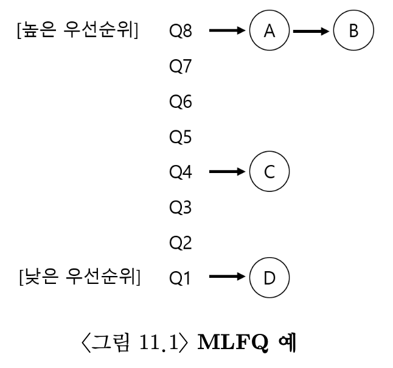

# 11. 스케줄링: 멀티 레벨 피드백 큐
#OS/OSTEP/이론/가상화

가장 유명한 **멀티 레벨 피드백 큐(Multi-level Feedback Queue, MLFQ)** 스케줄링 기법에 대해 알아보자.
- 이 스케줄링 기법은 Compatible Time-Sharing System(CTSS)에서 사용된다.
- 수년동안 다듬어져 일부 현대 시스템까지 발전되었다.

MLFQ가 해결하려고 하는 기본적인 문제는 두 가지이다.
1. 짧은 작업을 먼저 실행시켜 ***반환 시간*을 최적화** 한다.
    - SJF, STCF는 작업의 실행 시간 정보를 필요로 한다는 단점이 있었다.
2. **응답 시간을 최적화**한다.
    - 대화형 사용자에게 응답이 빠른 시스템이라는 경험을 주기 위해서이다.
    - RR 같은 알고리즘은 응답 시간은 빨라도 반환 시간이 최악이다.

작업 **실행 시간 정보 없이** **반환 시간도 최적화**하고 **응답 시간도 최적화** 하는 스케줄러를 어떻게 만들 수 있을까?
- **실행 중인 작업의 특성**을 알아내고, 이를 이용하여 더 나은 스케줄링 결정을 하기 위한 방법을 찾아야 한다.

## 11.1 MLFQ: 기본 규칙
MLFQ는 여러 구현 형태가 있어서 자세한 부분에서 차이가 조금 있지만 기본적으로는 비슷한 방법을 사용한다.

MLFQ는 여러 개의 큐로 구성되며, 각각 다른 **우선순위(priority level)**이 배정된다.
- 실행 준비가 된 프로세스는 이 중 하나의 큐에 존재한다.
- MLFQ는 실행할 프로세스를 결정하기 위하여 우선순위를 사용한다. 높은 우선순위 큐에 존재하는 작업이 선택된다.

큐에서는 둘 이상의 작업이 존재할 수 있는데, 이들은 모두 같은 우선순위를 가지고, 라운드 로빈 스케줄링 알고리즘이 사용된다.

MLFQ 스케줄링의 핵심은 **우선순위를 정하는 방식**이다. 각 작업에 고정된 우선순위를 부여하는게 아니라, **작업의 특성에 따라 동적으로 우선순위를 부여**한다.


- 예를 들면, 키보드 입력을 기다리며 반복적으로 CPU를 양보하면 해당 작업의 우선순위를 높게 유지한다.
    - 자세한 이유는 아래서 다룬다. MLFQ 스케줄링의 결과로 이렇게 나온는거다.
- 한 작업이 긴 시간동안 CPU를 집중적으로 사용하면 MLFQ는 해당 작업의 우선순위를 낮춘다.
  이렇게 작업이 진행되는 동안 작업의 정보를 얻고, 이를 이용해 미래 행동을 예측한다.

> 그냥 생각을 해보면, IO 작업, yield 등 CPU를 거의 사용하는 작업들은 우선순위를 높게 잡아도 CPU를 거의 점유하지 않고, 전체적으로 처리되는 작업의 throughput이 좋아질 것이라고 생각해낼 수 있다.

> [!NOTE] MLFQ의 두 가지 기본 규칙
> - 규칙 1: Priority(A) > Priority(B) 이면, A가 실행된다 (B는 실행되지 않는다).
> - 규칙 2: Priority(A) = Priority(B) 이면, A와 B는 RR 방식으로 실행된다.

이 두 규칙만으로는 문제가 있다. MLFQ에서는 우선순위가 높은 작업을 수행하는데, 우선순위가 낮아진 작업은 실행되지 않는다. 추가적인 규칙을 알아보자.

## 11.2 시도 1: 우선순위의 변경
MLFQ가 작업의 우선순위를 어떻게 바꿀 것인지 결정하는 기준을 알아보자. 이를 위해선 워크로드의 특성을 반영해야 한다.
두 가지로 작업을 분류해보자.
1. 짧은 실행 시간을 갖는, CPU를 자주 양보하는 대화형 작업
2. 많은 CPU 시간을 요구하지만 응답 시간은 중요하지 않은 긴 실행 시간의 CPU 위주 작업
   <!-- {"width":348} -->
> - **규칙 3**: 작업이 시스템에 진입하면 가장 높은 우선순위, 즉 맨 위의 큐에 놓여진다.
> - **규칙 4a**: 주어진 타임 슬라이스를 모두 사용하면 우선순위는 낮아진다. 즉, 한 단계 아래 큐로 이동한다.
> - **규칙 4b**: 타임 슬라이스를 소진하기 전에 CPU를 양도하면 같은 우선순위를 유지한다.

### 예시 1: 한개의 긴 실행 시간을 가진 작업
세 개의 큐로 이루어진 스케줄러이다. 매우 간단하다.
<!-- {"width":534} -->

### 예시 2: 짧은 작업과 함께
A는 오래 실행되는 CPU 위주 작업이고, B는 짧은 대화형 작업이다. A는 얼마 동안 이미 실행되 온 상태, B는 이제 도착했다고 가정.
<!-- {"width":428} -->
- 작업 B의 경우 실행 시간이 짧기 때문에 바닥 큐에 도착하기 전에 종료한다.
- 그런 후 A는 낮은 우선순위에서 실행을 재개한다.

이 예에서 알 수 있는 건, 스케줄러는 작업이 짧은 작업인지 긴 작업인지 알 수 없기 때문에 **일단 짧은 작업이라고 가정하여 높은 우선순위를 부여한다는 것이다.**
- 진짜 짧은 작업이면 빨리 실행되고 바로 종료된다.
- 짧은 작업이 아니라면 천천히 아래 큐로 이동하게 되고 스스로 긴 배치형 작업이라는 것을 증명하게 된다.
  이런 식으로 MLFQ는 SJF와 근사할 수 있다.

> **중간 정리: 멀티레벨 큐를 통해 짧은 작업인지 긴 작업인지를 판별할 수 있고, SJF처럼 처리할 수 있다.**

### 예시 3: 입출력 작업에 대해서는 어떻게?
규칙 4b에서 타임 슬라이스를 소진하기 전에 프로세서를 양도하면 같은 우선순위를 유지한다고 했다.
- 대화형 작업에서는 사용자 입력을 대기하면서 타임 슬라이스가 종료되기 전에 CPU를 양도하게 되고, 우선순위를 유지하게 된다.
- 아래 예에서 확인할 수 있다.
  <!-- {"width":641} -->
- B(회색)는 **대화형 작업**으로서 1ms 동안만 실행되고, A는 긴 배치형 작업으로 B와 CPU 사용을 경쟁한다.
- B는 CPU를 **계속 양도**하므로 MLFQ에서 **가장 높은 우선순위로 유지**한다.
    - 대화형 작업을 **빨리 실행**시킨다는 목표(**응답 속도 개선**)에 근접할 수 있다.

### 현재 MLFQ의 문제점
현재 MLFQ는 단순한데 잘 동작하는 것처럼 보인다. 하지만 이 방식에는 심각한 결점이 있다.

> 여기서 내가 생각해 낸건, Q0에 쌓인 작업이 높은 우선순위의 작업으로 인해 실행되지 않을 수 있다는 점이었다.

1. **기아 상태(starvation)**가 발생할 수 있다.
    - 너무 많은 대화형 작업이 존재하면 이 작업들이 CPU 시간을 소모하게 되고 긴 실행 시간 작업은 CPU 시간을 할당받지 못하게 된다.
2. 스케줄러를 자신에게 유리하게 동작하도록 프로그램을 다시 작성할 수 있다.
    - 스케줄러를 속여서 지정된 몫보다 더 많은 시간을 할당받도록 하게 만드는 걸 의미한다.
    - **고의적으로 타임 슬라이스가 끝나기 전**에 아무 파일에다가 I/O를 요청하면 **CPU를 양도**하게 되고, 규칙에 따라 같은 큐에 머물러 더 높은 CPU 시간을 얻게 된다.
    - ex) 99% 타임 슬라이스를 실행하고 CPU를 양도
3. 프로그램은 시간 흐름에 따라 특성이 변할 수 있다. CPU 작업이 대화형 작업으로 바뀔 수 있다.
    - 현재 방식으로는 바뀐 대화형 작업이 CPU 작업들과 같은 대우를 받을 수 있다.

## 11.3 시도 2: 우선순위의 상향 조정
주기적으로 모든 작업의 우선순위를 **상향 조정(boost)**한다. 가장 간단한 방법으로 모두 최상위 큐로 보낸다.
> [!NOTE] 규칙 5
> 일정 기간 S가 지나면, 시스템의 모든 작업을 최상위 큐로 이동시킨다.

이를 통해 다음과 같은 효과를 얻을 수 있다.
1. 프로세스는 **굶지 않는다**는 것을 **보장**받는다.
    - 최상위 큐로 올라가면 RR 방식으로 CPU를 공유받게 된다.
2. CPU 위주의 작업이 대화형 작업으로 **특성이 변할** 경우 우선순위 상향을 통해 스케줄러가 **변경된 특성에 적합한 스케줄링 방법을 적용**한다.

<!-- {"width":708} -->
- 왼쪽 그래프는 우선순위 상향이 없고, 오른쪽 그래프는 50ms 마다 우선순위 상향이 일어난다.
- 오른쪽에서는 긴 실행 시간 작업도 꾸준히 진행된다는 것을 알 수 있다.

그렇다면 S값(부스트 주기)을 얼마로 해야 할까? 이런 종류의 값은 **부두 상수**로, 정확히 결정하기 어렵다.
- 너무 크면 긴 실행 시간을 가진 작업은 굶을 수 있다.
- 너무 작으면 대화형 작업이 적절한 양의 CPU 시간을 사용할 수 없다.
    - 계속 높은 큐로 긴 CPU 작업들이 침투된다.

## 11.4 시도 3: 더 나은 시간 측정
남은 문제 한 가지. 스케줄러를 **자신에게 유리하게 동작시키는 것을 어떻게 막을 수** 있을까?
- 사실 이 문제의 주 원인은 규칙 4a와 규칙4b이다.
- 타임 슬라이스가 끝나기 전에 CPU 를 양보하여 우선 순위를 유지가 가능하게 한다.

여기서 해결책은, MLFQ의 각 단계에서 **CPU 총 사용 시간을 측정**하는 것이다. 스케줄러는 현재 단계에서 **프로세스가 소진한 CPU 사용 시간을 저장**한다. 타임 슬라이스에 **해당하는 시간을 모두 소진**하면 다음 우선순위 큐로 **강등**된다.

> [!NOTE] 규칙 4 재정의
> **규칙 4**: 주어진 단계에서 시간 할당량을 소진하면(CPU 양도 횟수와 상관 없이) 우선순위는 낮아진다.

**Before After 비교 예시**
<!-- {"width":752} -->
- 새로운 조작 방지 규칙이 들어간 우측의 경우 프로세스의 입출력 행동과 무관하게 아래 단계 큐로 천천히 이동하게 되어 CPU를 자기 몫 이상으로 사용할 수 없게 된다.

## 11.5 MLFQ 조정과 다른 쟁점들
아직 MLFQ에 다른 쟁점들이 여럿 남아있다. **필요한 변수**들을 스케줄러가 어떻게 설정해야 할까?
- **몇 개의 큐**가 존재해야 할까?
- **타임 슬라이스의 크기**는 얼마로 해야 할까?
- 얼마나 자주 우선순위가 상향 조정되어야 할까? (**우선순위 상향 주기**)
  이에 대한 답은, 워크로드에 대해 충분히 **경험**하고 계속 조정해 나가면서 균형점을 찾아야 한다는 것이다.

대부분의 MLFQ 기법들은 **큐 별로 타임 슬라이스를 변경**할 수 있다.
- **우선순위가 높은 큐**는 보통 **짧은** 타임 슬라이스가 주어진다.
    - **우선순위가 높은 큐**는 대화형 작업같은 것들로 구성되야 하므로, **작업들을 빠르게 교체**하도록 하는 것.
- 낮은 우선순위는 긴 타임 슬라이스가 적합하다.
    - 낮은 우선순위의 작업이 실행된다는 건, 보통 긴 CPU 작업이 실행된다는 것이다. 낮은 우선순위 큐에 타임 슬라이스를 너무 짧게 설정하면 오히려 비효율적일 수 있다.
      <!-- {"width":507} -->

Solaris의 경우 위에서 봤던 몇 개의 큐, 타임 슬라이스 크기, 얼마나 자주 Boost 이런 것들을 결정하는 테이블을 제공한다.
이 테이블을 수정하여 스케줄러의 동작 방식을 바꿀 수 있다.

다른 MLFQ 스케줄러는 테이블이나 이 장에서 설명한 정확한 규칙 같은 건 사용하지 않는다. 주로 수학 공식을 사용하여 우선순위를 조정한다.
- 예를 들어 FreeBSD 스케줄러는 작업의 현재 우선순위를 계산하기 위하여 프로세스가 사용한 CPU 시간을 기초로 한 공식을 사용한다.
    - CPU 사용 시간은 시간이 지남에 따라 감쇠되어 이 장에서 설명한 방식과는 다른 방식으로 우선순위 상향을 제공한다.
    - **감쇠-사용(decay-usage)** 알고리즘이라고 한다.

**스케줄러가 제공하는 다른 여러 기능**
- 일부 스케줄러는 가장 **높은 우선순위를 운영체제 작업을 위해 예약**해 둔다.
    - 일반 사용자는 가장 높은 우선순위를 얻을 수 없다.
- 일부 시스템은 **사용자가 우선순위를 정하는데 도움**을 줄 수 있도록 **허용**한다.

## 11.6 MLFQ 요약
- 알고리즘은 멀티 레벨 큐를 가지고 있으며 지정된 작업의 우선순위를 정하기 위하여 피드백을 사용한다.
- 과거에 보여준 행동이 우선순위 지정의 지침이 된다.
    - 행동이 바껴도 우선순위 Boost를 통해 조정이 된다.
    - 작업 특성에 대한 정보가 없어도, 마치 작업 실행을 관찰하여 그에 따라 우선순위를 지정하는 것과 같다.
- MLFQ는 반환 시간, 응답 시간을 모두 최적화한다.
- 짧게 실행되는 대화형 작업에서 전반적으로 우수한 성능을 제공한다.
- Windows를 포함한 많은 시스템이 기본 스케줄러로 MLFQ를 사용한다.

> [!NOTE] 규칙 총 정리
> - 규칙 1: Priority(A) > Priority(B) 이면, A가 실행된다 (B는 실행되지 않는다).
> - 규칙 2: Priority(A) = Priority(B) 이면, A와 B는 RR 방식으로 실행된다.
> - 규칙 3: 작업이 시스템에 진입하면 가장 높은 우선순위, 즉 맨 위의 큐에 놓여진다.
> - 규칙 4: 주어진 단계에서 시간 할당량을 소진하면(CPU 양도 횟수와 상관 없이) 우선순위는 낮아진다.
> - 규칙 5: 일정 기간 S가 지나면, 시스템의 모든 작업을 최상위 큐로 이동시킨다.

## 구현 코드 코드 실행 결과
```
[time= 0] NEW READY A-longCPU(Level=0, phase=CPU:20, usedTimeInLevel=0) -> Q0
[time= 0] NEW READY B-interactive(Level=0, phase=CPU:1, usedTimeInLevel=0) -> Q0
[time= 0] NEW READY C-medium(Level=0, phase=CPU:10, usedTimeInLevel=0) -> Q0
[time= 0] PICK A-longCPU from Q0
[time= 0] RUN  A-longCPU(Level=0, phase=CPU:19, usedTimeInLevel=1)
[time= 1] RUN  A-longCPU(Level=0, phase=CPU:18, usedTimeInLevel=2)
[time= 2] DEMOTE A-longCPU from L0 to L1 -> Q1
[time= 2] PICK B-interactive from Q0
[time= 2] RUN  B-interactive(Level=0, phase=CPU:0, usedTimeInLevel=1)
[time= 3] B-interactive -> BLOCKED(IO:4)
[time= 3] IO   B-interactive (remaining=3)
[time= 3] PICK C-medium from Q0
[time= 3] RUN  C-medium(Level=0, phase=CPU:9, usedTimeInLevel=1)
[time= 4] IO   B-interactive (remaining=2)
[time= 4] RUN  C-medium(Level=0, phase=CPU:8, usedTimeInLevel=2)
[time= 5] DEMOTE C-medium from L0 to L1 -> Q1
[time= 5] IO   B-interactive (remaining=1)
[time= 5] PICK A-longCPU from Q1
[time= 5] RUN  A-longCPU(Level=1, phase=CPU:17, usedTimeInLevel=1)
[time= 6] IO   B-interactive (remaining=0)
[time= 6] IO DONE -> READY B-interactive at L0
[time= 6] PREEMPT A-longCPU -> back to Q1, run B-interactive
[time= 6] RUN  B-interactive(Level=0, phase=CPU:0, usedTimeInLevel=2)
[time= 7] B-interactive -> BLOCKED(IO:4)
[time= 7] IO   B-interactive (remaining=3)
[time= 7] PICK C-medium from Q1
[time= 7] RUN  C-medium(Level=1, phase=CPU:7, usedTimeInLevel=1)
[time= 8] IO   B-interactive (remaining=2)
[time= 8] RUN  C-medium(Level=1, phase=CPU:6, usedTimeInLevel=2)
[time= 9] IO   B-interactive (remaining=1)
[time= 9] RUN  C-medium(Level=1, phase=CPU:5, usedTimeInLevel=3)
[time=10] IO   B-interactive (remaining=0)
[time=10] IO DONE -> READY B-interactive at L0
[time=10] PREEMPT C-medium -> back to Q1, run B-interactive
[time=10] RUN  B-interactive(Level=0, phase=CPU:0, usedTimeInLevel=3)
[time=11] B-interactive -> BLOCKED(IO:4)
[time=11] IO   B-interactive (remaining=3)
[time=11] PICK A-longCPU from Q1
[time=11] RUN  A-longCPU(Level=1, phase=CPU:16, usedTimeInLevel=2)
[time=12] IO   B-interactive (remaining=2)
[time=12] RUN  A-longCPU(Level=1, phase=CPU:15, usedTimeInLevel=3)
[time=13] IO   B-interactive (remaining=1)
[time=13] RUN  A-longCPU(Level=1, phase=CPU:14, usedTimeInLevel=4)
[time=14] DEMOTE A-longCPU from L1 to L2 -> Q2
[time=14] IO   B-interactive (remaining=0)
[time=14] IO DONE -> READY B-interactive at L0
[time=14] PICK B-interactive from Q0
[time=14] RUN  B-interactive(Level=0, phase=CPU:0, usedTimeInLevel=4)
[time=15] B-interactive -> BLOCKED(IO:4)
[time=15] IO   B-interactive (remaining=3)
[time=15] PICK C-medium from Q1
[time=15] RUN  C-medium(Level=1, phase=CPU:4, usedTimeInLevel=4)
[time=16] DEMOTE C-medium from L1 to L2 -> Q2
[time=16] IO   B-interactive (remaining=2)
[time=16] PICK A-longCPU from Q2
[time=16] RUN  A-longCPU(Level=2, phase=CPU:13, usedTimeInLevel=1)
[time=17] IO   B-interactive (remaining=1)
[time=17] RUN  A-longCPU(Level=2, phase=CPU:12, usedTimeInLevel=2)
[time=18] IO   B-interactive (remaining=0)
[time=18] IO DONE -> READY B-interactive at L0
[time=18] PREEMPT A-longCPU -> back to Q2, run B-interactive
[time=18] RUN  B-interactive(Level=0, phase=CPU:0, usedTimeInLevel=5)
[time=19] FINISH B-interactive
[time=19] PICK C-medium from Q2
[time=19] RUN  C-medium(Level=2, phase=CPU:3, usedTimeInLevel=1)
[time=20] RUN  C-medium(Level=2, phase=CPU:2, usedTimeInLevel=2)
[time=21] RUN  C-medium(Level=2, phase=CPU:1, usedTimeInLevel=3)
[time=22] RUN  C-medium(Level=2, phase=CPU:0, usedTimeInLevel=4)
[time=23] FINISH C-medium
[time=23] PICK A-longCPU from Q2
[time=23] RUN  A-longCPU(Level=2, phase=CPU:11, usedTimeInLevel=3)
[time=24] RUN  A-longCPU(Level=2, phase=CPU:10, usedTimeInLevel=4)
[time=25] RUN  A-longCPU(Level=2, phase=CPU:9, usedTimeInLevel=5)
[time=26] RUN  A-longCPU(Level=2, phase=CPU:8, usedTimeInLevel=6)
[time=27] RUN  A-longCPU(Level=2, phase=CPU:7, usedTimeInLevel=7)
[time=28] RUN  A-longCPU(Level=2, phase=CPU:6, usedTimeInLevel=8)
[time=29] DEMOTE A-longCPU from L2 to L2 -> Q2
[time=29] PICK A-longCPU from Q2
[time=29] RUN  A-longCPU(Level=2, phase=CPU:5, usedTimeInLevel=1)
[time=30] === PRIORITY BOOST ===
[time=30] PICK A-longCPU from Q0
[time=30] RUN  A-longCPU(Level=0, phase=CPU:4, usedTimeInLevel=1)
[time=31] RUN  A-longCPU(Level=0, phase=CPU:3, usedTimeInLevel=2)
[time=32] DEMOTE A-longCPU from L0 to L1 -> Q1
[time=32] PICK A-longCPU from Q1
[time=32] RUN  A-longCPU(Level=1, phase=CPU:2, usedTimeInLevel=1)
[time=33] RUN  A-longCPU(Level=1, phase=CPU:1, usedTimeInLevel=2)
[time=34] RUN  A-longCPU(Level=1, phase=CPU:0, usedTimeInLevel=3)
[time=35] FINISH A-longCPU
=== All done at time 35 ===
```
- 대화형 작업(B-interactive)은 끝까지 높은 우선순위가 유지된다.
- CPU 집중 작업(A-longCPU, C-medium)은 점진적으로 낮은 우선순위로 강등된다.
- 대화형 작업(B) 때문에 A와 C는 계속 선점된다,
- 우선순위 Boost(규칙 5)의 효과가 명확하게 드러난다. boost 후 L0로 리셋되어 실행됨을 볼 수 있다.
- 대화형 작업은 전체 시스템 CPU 사용률에 거의 영향을 주지 않으면서 사용자 입장에서는 빠르게 응답하는 효과를 제공한다.

# 깔끔하게 요약
## 1. MLFQ의 목적
MLFQ의 목적은 **실행 시간 정보를 모른 채**
1. **짧은 작업의 반환 시간**을 좋게 만들고(SJF 비슷하게),
2. **대화형 작업의 응답 시간**도 빠르게 유지하는 스케줄러를 만드는 것이다.

이를 위해 작업마다 고정 우선순위를 주지 않고, **실행 과정에서 드러나는 행동 패턴에 따라 우선순위를 동적으로 조정**한다.
⠀
## 2. 기본 아이디어와 초기 규칙
MLFQ는 여러 개의 **우선순위 큐**로 구성되며,
* 높은 큐에 있는 작업이 항상 먼저 실행된다(규칙 1).
* 같은 큐 내부에서는 **라운드 로빈**으로 CPU를 나눈다(규칙 2).

초기 규칙은 다음과 같다.
* 새 작업은 항상 **최상위 큐**에서 시작한다(규칙 3).
* 한 단계에서 **타임 슬라이스를 다 쓰면** 아래 큐로 내려간다(규칙 4a).
* 타임 슬라이스를 다 쓰기 전에 **스스로 CPU를 양보**하면 같은 큐에 남는다(규칙 4b).

이 구조 덕분에,
* 짧거나 자주 양보하는 대화형 작업은 **위쪽 큐에 남아 빠르게 처리**되고,
* 오래 CPU를 붙잡는 작업은 **아래 큐로 밀려 내려가 긴 배치 작업처럼 취급**된다.

즉, 실행 시간 정보를 직접 알지 못해도 **SJF에 근사한 행동**을 할 수 있다.
⠀
## 3. 드러난 문제점 세 가지
하지만 이 초기 설계에는 세 가지 큰 문제가 있다.
1. **기아(starvation)**
    * 높은 우선순위 큐에 대화형 작업이 많으면, 아래 큐의 긴 작업들은 CPU를 거의 받지 못하고 **사실상 굶게 된다**.
2. **스케줄러 “속이기”(gaming)**
    * 규칙 4b를 악용해서 타임 슬라이스의 대부분을 쓰다가 **일부러 I/O를 호출하며 양보**하면 실제로는 CPU를 많이 쓰면서도 **높은 큐에 계속 남아** 자기 몫 이상의 CPU를 차지할 수 있다.
3. **작업 특성 변화 반영 부족**
    * 처음에는 CPU 위주였다가 나중에 대화형으로 바뀐 작업도, 한 번 아래 큐로 내려가면 **오랫동안 낮은 우선순위 취급**을 받게 되어 **행동 변화가 우선순위에 잘 반영되지 않는다**는 문제가 있다.

## 4. 문제 해결을 위한 두 가지 보완
### 4.1 우선순위 상향(Boost) – 규칙 5
> **규칙 5**: 일정 시간 S가 지나면, **모든 작업을 최상위 큐로 이동**시킨다.
이 규칙의 효과는 두 가지이다.
* **기아 방지**
    * 아무리 아래 큐에 있던 작업도 주기적으로 최상위 큐에 올라와 RR 방식으로 **반드시 CPU를 조금씩이라도 보장받게 된다**.
* **특성 변화 반영**
    * 과거에는 CPU 위주였던 작업이 나중에 대화형으로 바뀌어도 상향 시점마다 다시 위에서 시작하므로, 이후 행동에 따라 **대화형 작업으로 재평가**될 수 있다.

단, 상향 주기 S는
* 너무 크면 여전히 긴 작업이 오래 굶고,
* 너무 작으면 긴 작업이 자꾸 위로 올라와 **대화형 작업과 섞여 버리는** 문제가 있어 **워크로드에 맞게 튜닝해야 하는 값**으로 남는다.

### 4.2 CPU 총 사용 시간 기준 강등 – 규칙 4 재정의
스케줄러 속이기 문제는, “**타임 슬라이스를 한 번에 다 썼는지만** 보고 우선순위를 내린다”는 점에서 생긴다.
이를 해결하기 위해 규칙 4를 다음과 같이 바꾼다.

> **재정의된 규칙 4:** 한 우선순위 단계에서 **CPU를 사용한 총 시간**이 그 단계의 **시간 할당량을 모두 소진**하면, **CPU 양보 횟수와 상관 없이** 아래 큐로 강등한다.

이렇게 하면,
* 프로세스가 **조금 쓰고 양보**를 반복하더라도, 해당 단계에서 쓴 **CPU 시간의 누적 합**이 일정 기준을 넘으면 **반드시 아래 큐로 내려가게** 된다.
* 따라서 I/O를 끼워 넣어 **자기 몫 이상의 CPU 시간을 빼앗는 꼼수**는 통하지 않게 된다.
  ⠀
## 5. 남는 쟁점들
보완된 MLFQ도 여전히 **튜닝해야 할 요소**들이 남아 있다.
* 큐의 개수를 몇 개로 할지
* 각 큐의 타임 슬라이스 크기를 어떻게 나눌지
    * 보통 **위쪽 큐는 짧게**, **아래 큐는 길게** 잡는다.
* 우선순위 상향 주기 S를 어느 정도로 할지

이 값들은 워크로드마다 “정답”이 다르기 때문에, 운영체제는 **경험과 실험을 통해 적당한 균형점**을 찾아야 한다.
현대 시스템(Windows, Solaris, FreeBSD 등)은 모두 **MLFQ 철학을 기반**으로 하되, 테이블이나 수학 공식(예: decay-usage)을 사용해 **자기 시스템에 맞는 방식으로 변형**하여 사용하고 있다.
