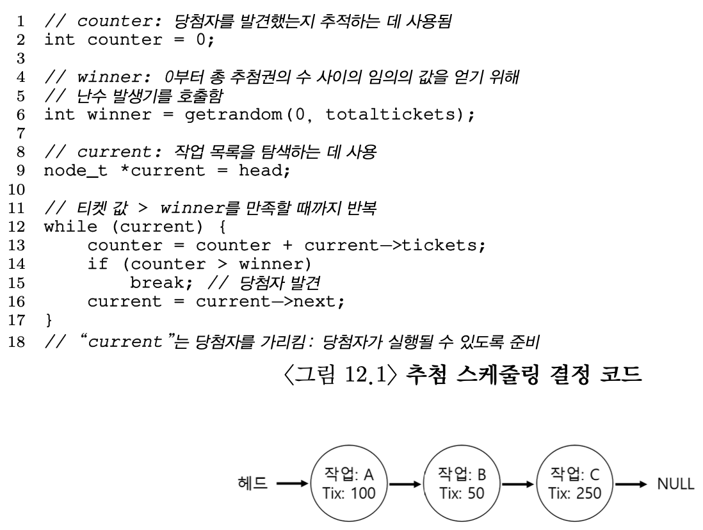

# 12. 스케줄링 : 비례 배분
#OS/OSTEP/이론/가상화

## 12.0 등장 배경
1. 앞서 다룬 MLFQ는 히스토리 기반 휴리스틱이다. “대화형이면 상위 큐”, “CPU-bound면 하위 큐” 이런 식으로 유도되도록 설계되었을 뿐, CPU를 몇 % 줄지에 대한 명시적인 제어가 불가능하다.
    - A는 80% CPU가 필요
    - B는 20% CPU가 필요
→ **MLFQ는 이렇게 비율을 정확히 나눌 방법이 없다.**
2. MLFQ는 상호 간섭(interference)이 심하다. 새로운 프로세스가 들어오면 기존 프로세스들의 큐 레벨이 변경되거나 응답 시간 패턴이 흔들린다. CPU 사용량을 예측하거나 통제하기 어렵다.
3. 멀티테넌트(multi-tenant) 환경에서는 공정성이 중요하다. 클라우드/컨테이너/VM 환경에서 여러 고객(tenant)이 같은 물리 자원(CPU)을 공유한다. 응답시간 최적화보단, 자원 비율을 보장하는 것이 훨씬 중요하다.

MLFQ는 “응답속도 좋은 데스크탑/대화형 환경”에 좋지만, “멀티테넌트, 클라우드, 공정 배분이 중요한 환경”에는 부적합하다.
그래서 **공정하게 CPU 비율을 보장하려는 요구**가 생기면서 **비례배분 스케줄링** 등이 등장했다

이번 챕터에서는 **비례 배분(Proportional Share)**, 혹은 **공정 배분(fair share)**라고 하는 유형의 스케줄러에 대해 다룬다.
- 비례 배분은 **반환 시간이나 응답 시간을 최적화하는 대신, 스케줄러가 각 작업에게 CPU의 일정 비율을 보장**하는 것이 목적이다.
- 대표적인 좋은 예로 **추첨 스케줄링(lottery scheduling)**이 있다.
    - 다음 실행될 프로세스를 추첨을 통해 결정한다.
    - 더 자주 수행되어야 하는 프로세스는 당첨 기회를 더 많이 준다.

어떻게 정해진 비율 만큼 배분할 수 있는 것일까?

## 12.1 기본 개념 : 추첨권이 당신의 몫을 나타낸다.
**추첨권(티켓)**은 프로세스가 받아야 할 자원의 몫을 나타내는데 사용된다. 전체 티켓에 대한 프로세스 소유 티켓 비율이 자신의 몫이다.
- 프로세스 A 75장, 프로세스 B 25장이라면, A에게 75% CPU를, B에게 25% CPU를 할당하는 것이 목적이다.

이런 목적을 확률적으로 달성한다. 추첨 방식이다. 전체 티켓 개수를 바탕으로 스케줄러는 추첨권을 선택한다.
- 전체 100장이면, 0~99 중 하나를 뽑는다.
- A는 0 ~ 74, B는 75~99 추첨권을 가지고 있다.
- 만약 70이 뽑히면 A, 80이 뽑히면 B를 스케줄할 것이다.

하지만 무작위성은 원하는 비율을 정확히 보장하지 않는다. 장시간 실행될 수록 원하는 비율을 달성할 가능성이 높아진다.

## 12.2 추첨 기법
### 추첨권 화폐
추첨권을 다루는 기법 중 하나는 **추첨권 화폐(ticket currency)** 개념이다.
- 사용자가 추첨권을 자신의 화폐 가치로 자유롭게 바꿀 수 있다.
- 시스템이 알아서 화폐 가치를 변환해준다.

예를 들어, 사용자 A, B가 각각 100장씩 추첨권을 받았다고 해보자.
- 사용자 A는 작업 A1, A2 두 개의 작업을 실행 중이고 자신이 정한 화폐로 각각 500장의 추첨권을 할당하였다.
- 사용자 B는 하나의 작업 B1만 수행중이고, 자신 기준 화폐 10장 중에 10장을 모두 할당하였다.
    - 시스템은 사용자 A 기준 화폐 각 500장을 전역 기준 화폐 각 50장으로 변환한다.
    - 시스템은 B1의 추첨권 10장을 전역 추첨권 100장으로 변환한다.
    - CPU 전체에 대한 자원을 각 사용자가 분배 받아, 자신들 내부에서 사용할 수 있는 화폐로 바꾸는 것이다.

### 추첨권 양도
또 다른 기법으로는 **추첨권 양도(ticket transfer)**가 있다.
- 프로세스는 일시적으로 추첨권을 다른 프로세스에게 넘겨줄 수 있다.
- ex) 클라이언트 - 서버 구조에서, 클라이언트가 특정 작업을 서버에게 대신 처리해달라고 할 때 추첨권을 주고 받는다.

### 추첨권 팽창
**추첨권 팽창(ticket inflation)**도 유용하게 사용된다.
- 자신이 소유한 추첨권의 수를 늘이거나 줄일 수 있다.
- 신뢰하지 않는 프로세스들이 상호 경쟁하는 상황에선 의미 없고, *프로세스들이 서로 신뢰할 때 유용하다.*
- 어떤 프로세스가 더 많은 CPU 시간이 필요하다면 시스템에게 이를 알려 다른 프로세스와 통신하지 않고 혼자 추첨권 가치를 상향 조정한다.

## 12.3 구현
추첨 스케줄링은 **구현이 단순**하다. 난수 발생기, 프로세스들의 집합을 표현하는 자료구조, 추첨권의 전체 개수 뿐이다.
<!-- {"width":484} -->
- 프로세스 리스트를 순회하면서 counter 값이 winner의 값을 초과할 때 각 추첨권 개수를 counter에 더한다.
    - 값이 초과하게 되면 리스트의 현재 원소가 당첨자가 된다.
- 예를 들어, 총 추첨권 400개 중 300이 선택되었으면 리스트를 순회하여 당첨자를 찾아낸다.
    - A의 추첨권 개수가 더해져 counter는 100이고, 100은 300보다 작으므로 루프를 실행한다.
    - (B) 다음 counter는 150으로, 300보다 작다.
    - (C) 다음 counter는 400으로, 300보다 크다. 당첨자는 C다.
- 일반적으로 리스트를 내림차순으로 정렬하면 가장 효율적이다.
    - 검색 횟수가 최소화되는 것을 보장한다.
    - 적은 수의 프로세스가 대부분의 추첨권을 가지고 있다면 특히 효율적이다.

## 12.4 예제
CPU를 공유하는 두 개의 작업이 각각 100개씩 추첨권을 가지고 있고, 동일한 실행 시간을 갖는다고 해보자.
만약 두 작업을 거의 동시에 종료시키려고 하려고 해도 무작위성 때문에 한 작업이 다른 작업보다 먼저 종료될 수 있다.
이 차이를 정량화하기 위해 **불공정 지표(unfairness metric)** *U* 를 정의한다.
- 첫 번째 작업이 종료된 시간을 두 번째 작업이 종료된 시간으로 나누면 된다.
- 두 작업이 거의 동시에 종료하면 U = 1에 근접한다.

<!-- {"width":386} -->
- 길이가 길지 않은 경우 평균 불공정 정도는 심각하다.
- 작업이 충분한 기간 동안 실행되어야 추첨 스케줄러는 원하는 결과를 얻는다.

## 12.5 추첨권 배분 방식
아직 남은 문제가 있다. **추첨권을 나누는 방식, 즉 몇 개씩 분배해야 하는지**이다. 이는 상당히 어렵다.
- 한 가지 접근 방법은, 사용자가 가장 잘 알고 있다고 가정하고 사용자가 작업들에게 추첨권을 배분하는 것이다.
    - 이는 해결책이 아니다.

## 12.6 왜 결정론적(Deterministic) 방법을 사용하지 않는가?
*무작위성*을 이용하면 스케줄러를 단순하게 만들 수 있지만 *정확한 비율을 보장할 수 없다.*
Waldspurger는 **결정론적 공정 배분 스케줄러**인 **보폭 스케줄링(stride scheduling)**을 고안했다.
- 시스템의 각 작업은 보폭을 가지고 있다. 보폭은 추첨권 수에 반비례하는 값이다.
- 100, 50, 250 추첨권을 가지고 있다고 해보자. 임의의 큰 값을 각자의 추첨권 개수로 나누어 보폭을 계산한다.
    - 10000을 추첨권 개수로 나눈다면, 100, 200, 40이 된다.
- 이 값은 **보폭(stride)**이라고 부르며, 프로세스가 실행될 때 마다 **pass**라는 값을 보폭만큼 증가시켜 CPU 사용을 추적한다.

스케줄러는 보폭과 pass 값을 사용하여 어느 프로세스를 실행시킬지 결정한다.
- 기본적으로 가장 작은 pass 값을 가진 프로세스를 선택한다.
- 프로세스를 실행시킬 때 마다 pass 값을 보폭만큼 증가시킨다.
  <!-- {"width":847} -->

**ex) A 보폭 : 100, B 보폭 : 200, C 보폭 : 40**
- 각자의 pass 값은 모두 0에서 시작
- 처음에는 다 0이므로 무작위로 A 선택
- A의 pass 값이 100
- 그다음 B와 C 중 무작위로 B 선택
- B의 pass 값이 200
- C 실행하여 C의 pass값 40
- 다음에도 또 C를 실행하여 80
- 또 C : 120
- 이제 A 실행하여 pass값 200
- C 실행 : C 160
- C 실행 : C 200
- 이렇게 되면 A, B, C의 pass 값이 같아지고, 이 과정을 다시 반복한다.

여기서, C는 5번, A는 2번, B는 한 번만 실행되었다. **각자 가진 추첨권의 개수와 실행 횟수가 정확히 비례한다.**
- 추첨 스케줄링은 정해준 비율에 따라 확률적으로 분배하지만, **보폭 스케줄링은 각 스케줄링 주기마다 정확한 비율로 CPU를 분배한다.**

그렇다면 보폭 스케줄링이 더 좋아보이는데 추첨 스케줄링은 왜 사용할까??
<!-- {"width":432} -->
- 추첨 스케줄링은 보폭 스케줄링과 달리 상태 정보가 필요 없다.
    - 보폭 스케줄링은 pass 값을 계속 추적해야 한다.
    - 추첨 스케줄링은 프로세스 상태를 유지할 필요가 없다. 단지 새 프로세스 추가 시 새로운 프로세스가 가진 추첨권의 개수, 전체 추첨권의 개수만 갱신하고 스케줄한다.

## 12.7 요약
비례 배분 스케줄링 두 가지, 추첨권 스케줄링은 무작위성, 보폭 스케줄링은 결정적 방법으로 목적을 달성한다.
하지만 여러 이유로 둘 다 CPU 스케줄러로서 널리 사용되고 있지 않는다.
- 이러한 접근 방식이 특히 입출력과 맞물렸을 때, 제대로 동작하지 않는다
- 추첨권 할당이라는 어려운 문제가 남아있는 점도 있다.
- 범용 스케줄러(ex. MLFQ)는 이런 문제를 더 직관적으로 해결하므로 더 널리 사용된다.

비례 배분 스케줄러는 추첨권 할당량을 비교적 정확하게 결정할 수 있는 환경에서 유용하게 사용된다.
- ex) 가상화 데이터 센터에서, Windows VM에 사이클 1/4, 나머지는 Linux에 비례배분한다.

## 구현 코드 실행 결과
**totalTickets: 10**
```
totalTickets: 10
== Lottery ==
Task A: 10 ticks (100.00%)
Task B: 0 ticks (0.00%)

== Stride ==
Task A: 7 ticks (70.00%)
Task B: 3 ticks (30.00%)
```
- tick의 개수가 적기 때문에, 우리가 의도한 75:25와 먼 결과가 나왔다. (랜덤이기 때문에 결과는 실행마다 달라질 수 있다)

**totalTickets: 100**
```
totalTickets: 100
== Lottery ==
Task A: 76 ticks (76.00%)
Task B: 24 ticks (24.00%)

== Stride ==
Task A: 75 ticks (75.00%)
Task B: 25 ticks (25.00%)
```

**totalTickets: 10000**
```
totalTickets: 10000
== Lottery ==
Task A: 7535 ticks (75.35%)
Task B: 2465 ticks (24.65%)

== Stride ==
Task A: 7504 ticks (75.04%)
Task B: 2496 ticks (24.96%)
```
- tick(스케줄링 횟수)를 늘릴 수록 실행 비율이 ticket의 비율에 수렴한다.
- 여기서 알 수 있는 것은, Stride 방식이 Lottery 방식에 비해 조금 더 정확한 비율을 보장한다. (Lottery는 확률적 특성 때문에 항상 약간의 랜덤 오차가 남고, Stride는 결정론적이라 오차가 더 작다.)

> **Q) 실제로 Docker에서 비례 배분 스케줄러를 사용할까?**
> Docker는 런타임 격리를 수행한다. 실제 스케줄링은 Linux의 CPU 스케줄러 **CFS**가 한다. CFS는 Stride Scheduling 기반의 비례 배분 스케줄러이다.

## 깔끔하게 요약
### 1. 목적
비례 배분 스케줄링의 목적은 **각 작업에게 “CPU 몇 %”를 공정하게 보장하는 것**이다.
* “A 75%, B 25%”처럼 **비율 자체를 컨트롤**하려는 기술이다.
* 멀티테넌트·클라우드 환경에서 테넌트별 자원 보장을 위해 등장한 개념이다.

⠀
### 2. 기존 방식(MLFQ)의 문제
MLFQ는
* “대화형이면 상위 큐, CPU-bound는 하위 큐” 같은 **휴리스틱 기반**으로 동작한다.
* 따라서
    1. **정확한 비율(예: 80% vs 20%)을 지정할 수 없고**,
    2. 새 작업이 들어올 때 기존 작업들의 응답 패턴이 흔들리는 **상호 간섭이 크며**,
    3. 멀티테넌트 환경에서 요구되는 **예측 가능한 공정성**을 제공하기 어렵다.
       ⠀
### 3. 문제 해결 아이디어
**3.1 추첨 스케줄링(Lottery)**
* 각 프로세스에 **티켓 수 = CPU 몫**을 부여한다.
* 매번 난수로 티켓 하나를 뽑아 그 티켓을 가진 프로세스를 실행한다.
* **긴 시간 평균적으로는 비율에 수렴**한다.
* 티켓 화폐·양도·팽창 같은 기법으로 사용자/프로세스 간 자원 분배를 유연하게 조정할 수 있다.
* 구현은 단순하지만, **매 순간 정확한 비율을 보장하지는 못한다.**

**3.2 보폭 스케줄링(Stride)**
* 티켓 수에 **반비례하는 보폭(stride)**을 부여하고, 각 프로세스의 **pass 값을 누적**해 가장 작은 pass를 가진 프로세스를 실행한다.
* 실행할 때마다 pass += stride를 해서, **실행 횟수가 티켓 비율과 거의 정확히 일치**하도록 만든다.
* 추첨보다 **결정론적이고 비율이 더 정확**하지만, 각 프로세스의 pass 상태를 계속 관리해야 한다.
  ⠀
### 4. 남은 문제와 한계
1. **티켓/보폭을 얼마나 줄 것인가?**
    * 티켓 할당 자체가 어려운 정책 문제이다.
2. **I/O와의 상호작용**
    * CPU time만 기준으로 할당하면 I/O-bound 작업과 섞였을 때 공정성이 깨질 수 있다.
3. **상태 관리 비용**
    * stride 방식은 pass 등 추가 상태를 관리해야 하므로 복잡도가 올라간다.
4. **범용성 부족**
    * 응답 시간, 대화형 성능까지 함께 고려해야 하는 범용 OS에서는 MLFQ·CFS처럼 더 직관적인 스케줄러가 선호되는 경향이 있다.

### 5. 현실에서의 사용
* 비례 배분 아이디어는 **“할당량을 명확히 정할 수 있는 환경”**에서 유용하다.
    * 예: 데이터 센터에서 VM별로 CPU 비율을 정할 때.
* Docker 자체는 스케줄러가 아니고, 실제 CPU 스케줄링은 리눅스 **CFS**가 담당한다.
    * CFS는 stride와 유사한 개념(vruntime)을 이용해 **공정 배분에 가까운 동작**을 한다.
