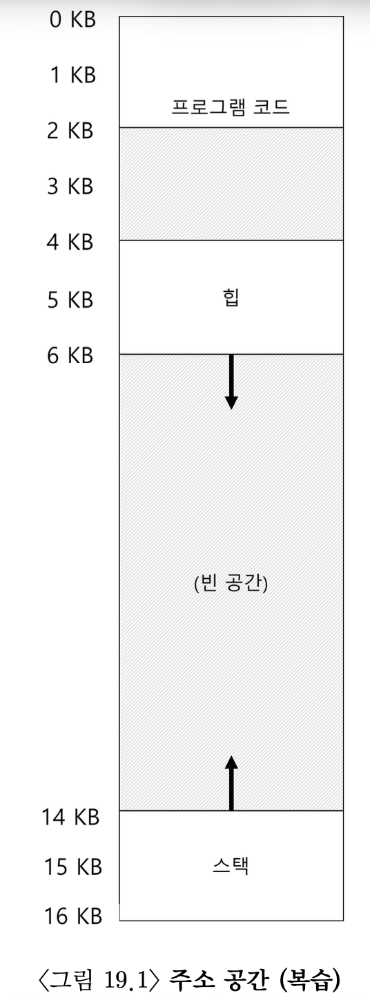

# 19. 세그멘테이션
#OS/OSTEP/이론/가상화

## 19.0 주소 공간 통째 탑재 방식의 문제점
지금까지는 프로세스 주소 공간 전체를 통째로 메모리에 탑재하는 것을 가정했다. 
이렇게 가정하면 베이스/바운드 레지스터를 통한 재배치가 쉬워지지만, 스택과 힙 사이에 사용되지 않는 큰 공간이 존재한다는 문제점이 존재했다.

스택과 힙 사이의 공간은 물리 메모리에 재배치할 때 물리 메모리를 차지한다. 메모리 낭비가 심하다.
또한, 주소 공간이 물리 메모리보다 큰 경우 실행이 매우 어렵다. 주소 공간의 크기가 4GB라고 해도, 일반적인 프로그램은 수 메가 바이트만 사용한다. 유연성이 부족하다고 할 수 있다.

## 19.1 세그멘테이션: 베이스/바운드의 일반화
이 문제를 해결하기 위해 등장한 아이디어가 `세그멘테이션(segmentation)`이다. MMU 안에 한 쌍의 베이스/바운드 레지스터를 두는게 아니라, **주소 공간의 논리적인 `세그먼트(segment)` 마다 베이스/바운드 레지스터 쌍이 존재한다.**

간단하게 우리의 기준에선 코드/스택/힙 세 종류의 세그먼트가 있다. 즉, 세 쌍의 바운드/레지스터 쌍이 존재하게 한다. 세그멘테이션을 사용하면 각 세그먼트를 물리 메모리의 각기 다른 위치에 배치할 수 있고, 사용되지 않는 가상 주소의 물리 메모리를 차지하는 것을 방지할 수 있다.
<!-- {"width":219} --><!-- {"width":526} -->
각 세그먼트마다 베이스/바운드 레지스터가 존재하기 때문에, 각 세그먼트를 물리적인 메모리의 각기 다른 위치에 배치시킬 수 있다.
그림에서 볼 수 있다 싶이, 사용 중인 메모리에만 물리 공간이 할당된다.

<!-- {"width":321} -->

가상 주소 100번지를 물리 주소로 재배치하는 과정을 살펴보자.
1. 가상 주소 100번지는 코드 세그먼트에 속한다.
2. 참조가 일어나면 하드웨어는 베이스 값에 이 세그먼트의 오프셋(100)을 더해 물리주소를 얻는다. (100 + 32KB)
3. 주소가 범위 내에 있는지 검사하고, 범위 내에 있는 경우 해당 물리 메모리 주소를 읽는다.

다만, 코드 영역이 아닌 다른 영역의 물리 주소를 얻을 땐 주의해야 할 점이 있다. **주소 공간 내에서의 가상 주소가, 물리 메모리 상의 오프셋이 아니라는 점이다.**
- 예를 들어 가상 주소 4200의 heap을 heap의 베이스 34KB에 더하면, 39016을 얻지만 이 주소는 올바른 주소가 아니다.
- **가상 주소 내에서의 offset을 구하는 것이 아니라, heap 내부에서의 offset을 구해야 한다.**
- 오프셋 4200은 실제로는 4200 - 4KB = 104가 된다.
- 이 오프셋 104를 베이스 34KB에 더해 올바른 물리 주소인 34920을 얻게 된다.

만약 힙의 마지막을 벗어난 잘못된 주소에 접근한다면, 하드웨어는 운영체제에 **트랩**을 발생시킨다. 이를 우리는 **segmentation fault 또는 segmentation violation**이라고 부른다.

## 19.2 세그먼트 종류의 파악
**하드웨어는 변환**을 위해 **세그먼트 레지스터**라는 걸 추가로 사용해야 한다. 하드웨어가 “**가상 주소가 어느 세그먼트를 참조**하는지”, 그리고 “**세그먼트 안에서 오프셋은** 얼마인지”를 알게 하기 위해서이다.

### 세그먼트 참조
일반적인 접근법은, 가상 주소의 최상위 몇 비트를 기준으로 주소 공간을 여러 세그먼트로 나누는 것이다.
현재 책에선 코드/스택/힙 3개의 세그먼트가 있으므로, 2비트가 필요하다. 가상 주소 14비트 중 최상위 2비트를 사용한다.
<!-- {"width":354} -->
- ex) 최상위 2비트가 00이면 코드 세그먼트를 가리킨다.
- ex) 최상위 2비트가 01이면 힙 세그먼트를 가리킨다.
- ex) 최상위 2비트가 11이면 스택 세그먼트를 가리킨다.

### 오프셋 구하기
하드웨어가 “가상 주소가 어느 세그먼트를 참조하는지” 알았다면, **해당 세그먼트의 베이스/바운드를 통해 오프셋을 구해야** 한다.
<!-- {"width":394} -->
- 여기서 하위 12비트는 세그먼트 내의 오프셋이다.
- **오프셋에 베이스 레지스터 값을 더하여 최종 물리 주소를 계산한다.**

또한 하위 12비트 오프셋을 이용하면 바운드 검사도 쉬워진다. 오프셋이 바운드(크기)보다 작은지 여부만 검사하면 된다.

### 미사용된 세그먼트 하나는?
2비트는 4가지를 나타낼 수 있는데, 세그먼트는 3가지이다. 즉, 전체 주소 공간의 1/4은 사용이 불가능하다. 
이를 해결하기 위해 일부 시스템은 코드와 힙을 하나의 세그먼트에 저장하고, 세그먼트 선택을 위해 1비트만 사용하기도 한다.
(물론 현대 운영체제들은 세그멘테이션 방식을 잘 사용하지 않는다)

### 다른 방식
세그먼트를 하드웨어적으로 **다른 방식**으로 파악할 수도 있다. **묵시적 접근** 방식에서는 주소가 어떻게 형성되었나를 관찰하여 세그먼트를 결정한다. PC에서 생성되면 코드 세그먼트, 주소가 스택/베이스 포인터에 기반을 둔다면 스택 세그먼트 이런식이다.

## 19.3 스택
**스택**은 물리 주소를 구하는 방식이 코드/힙과는 다르다. **다른 세그먼트들과는 반대 방향으로 확장**되기 때문이다. 다른 변환 방식이 필요하다.

1. 간단한 하드웨어를 추가한다. 어느 방향으로 확장하는지 나타낸다(1과 0)
   - 하드웨어는 반대 방향으로 늘어나는지를 확인할 수 있다.
2. 올바른 **음수 오프셋**을 얻는다.
   - 예를 들어, 하위 2비트가 3KB이고, 세그먼트의 최대 크기는 4KB, 스택의 베이스는 28KB라고 해보자
   - 스택의 베이스는 높은 주소를 가리키지만, 오프셋은 정방향 값을 저장한다. 
   - 그래서, (오프셋 - 세그먼트의 최대 크기)를 통해 음수 오프셋을 구해야 한다.
     - 3KB - 4KB = -1KB
   - 베이스에 음수 오프셋을 더함으로써 올바른 물리 주소를 얻게 된다.
     - 28KB + (-1KB) = 27KB

## 19.4 공유 지원
세그멘테이션 기법이 발전하면서, 하드웨어 지원으로 효율성을 챙길 수 있다는 점을 발전시켜나갔다. 
예를 들면, 메모리를 절약하기 위해 주소 공간들 간에 특정 메모리 세그먼트를 공유하게 하였다. **코드 공유**가 일반적이며, 현재 시스템에서도 광범위하게 사용중이다.
<!-- {"width":185} -->
공유를 지원하기 위해선 하드웨어의 **protection bit** 추가가 필요하다. 세그먼트마다 protection bit를 추가하여 세그먼트의 읽기/쓰기 여부, 그리고 코드의 실행 가능 여부를 나타낸다. 
**읽기 전용**으로 설정하면 공간의 독립성을 유지하면서 **주소 공간의 일부를 공유**할 수 있다. **각 프로세스는 자신의 전용 메모리**를 쓰고 있다고 **생각하지만 운영체제**는 영역을 비밀리에 공유시켜 **환상을 유지**하게 해준다.
<!-- {"width":581} -->

protection bit가 추가되엇으므로, 액세스가 허용되는지 검사하는 알고리즘이 추가되어야 한다. 액세스 허용이 되지 않는 경우 하드웨어는 예외를 발생시켜 운영체제가 프로세스를 처리한다.

## 19.5 소단위 대 대단위 세그멘테이션
우리가 다룬 것 처럼 소수의 세그먼트(코드/스택/힙)만을 지원하는 세그멘테이션을 **대단위(coarse-grained)** 세그멘테이션으로 분류할 수 있다. 큰 단위의 공간으로 분할하기 때문이다.

초기 시스템에선 주소 공간을 작은 크기의 공간으로 나누는 것을 허용하였고, 이를 **소단위(fine-grained)** 세그멘테이션이라 부른다.
많은 수의 세그먼트를 지원하면 여러 세그먼트 정보를 메모리에 저장할 수 있는 테이블 같은 하드웨어가 필요했다. **세그먼트 테이블**을 활용하였다. 

## 19.6 운영체제의 지원
세그멘테이션 덕분에 하나의 베이스/바운드 쌍의 동적 재배치에 비해 물리 메모리르 엄청나게 절약할 수 있다. 더 많은 주소 공간을 탑재할 수 있다.

하지만 세그멘테이션을 도입하면서 새로운 많은 문제가 생겨났다. 먼저 **운영체제 문제**를 살펴보면,
1. 컨텍스트 스위칭에서 운영체제는 어떤 일을 해야할까? -> 세그먼트 레지스터의 저장/복원
2. 미사용중인 물리 메모리 공간 관리는 어떻게 할 것인가?
   - 새로운 주소 공간 생성 시 비어있는 물리 메모리 영역을 찾아야 한다.
   - 예전엔 각 주소 공간 크기가 같다고 가정했지만, 이제는 프로세스가 많은 세그먼트를 가지고 크기가 각각 다르다.
   - 일반적으로 물리 메모리가 채워지면 작은 크기의 빈 공간들이 새로 생겨나서, 세그먼트에 할당하기 힘들어지고 기존의 세그먼트를 확장하는 데도 도움이 되지 않는다. 이를 **외부 단편화(external fragmentation)**이라 부른다.

### 외부 단편화와 물리 메모리 압축
<!-- {"width":475} -->
위 예시에선, 빈 공간의 크기의 총 합이 24KB이고 20KB를 할당하려고 한다. 하지만 연속된 공간이 아니라 세 개의 청크로 나누어져 요청을 충족시킬 수 없다.

이런 문제의 해결책 중 한 가지는, 기존 세그먼트를 정리하여 물리 메모리를 **압축(compact)**한다. 
- 현재 실행 중인 프로세스를 중단하고
- 그들의 데이터를 하나의 연속된 공간에 복사하고
- 세그먼트 레지스터가 새로운 물리 메모리 위치를 가리키게 한다.
운영체제가 작업할 수 있는 큰 빈 공간을 확보할 수 있게 되고, 새로운 할당 요청을 충족시킬 수 있게 된다.

하지만, 세그먼트 복사는 메모리에 부하가 큰 연산이고 상당향의 프로세서 시간을 사용하기 때문에 **압축은 비용이 많이 든다.**

### free-list 알고리즘
간단한 방법은 **빈 공간 리스트를 관리하는 알고리즘**을 사용하는 것이다. **할당 가능한 메모리 영역들을 리스트 형태로 유지**한다.
대표적으로 최적 적합(best-fit), 최악 적합(worst-it), 최초 적합(first-it) 및 버디 알고리즘(buddy algorithm) 등 수 백개의 방식이 존재한다. 

예를 들어, 최적 적합 방식은 free-list에서 요청된 크기와 가장 비슷한 크기의 공간을 할당한다. 하지만, **알고리즘이 아무리 정교하게 동작하더라도 외부 단편화는 여전히 존재한다.**

## 19.7 요약
세그멘테이션을 통해 메모리 가상화를 효과적으로 실현하고 기존의 많은 문제를 해결했다. 공간 낭비도 줄이고, 빠른 속도로 처리할 수 있었다. 코드 공유등의 추가적인 이점도 발생한다.

하지만 외부 단편화와 같은 몇 가지 문제가 발생한다. 그리고 아직 세그멘테이션이 드문드문 사용되는 주소 공간을 지원할 만큼 충분히 유현하지 못한다. 크기가 큰 힙이 드문드문 사용되는데 물리 메모리에 힙 전체를 올려놓고 있어야할까? 
이런 문제가 발생하는 것은, 주소 공간이 사용하는 모델과 세그멘테이션 설계방법이 일치하지 않기 때문이다. 새로운 해결책을 다음 챕터에서 찾아본다.

## 구현 코드 실행 결과
```
Code 세그먼트의 물리 주소 변환 시도
Code VA=100 -> PA=100

heap 세그먼트의 물리 주소 변환 시도
Heap VA=4296 -> PA=16584

stack 세그먼트의 물리 주소 변환 시도
Stack VA=13312 -> PA=33792

코드 세그먼트에 WRITE 시도(트랩 발생)
Expected fault (code write): WRITE denied in segment: code

힙의 limit 밖의 offset에 접근(트랩 발생)
Expected fault (heap OOB): Out of bounds in segment: heap
```

# 깔끔하게 요약
## 1\. 세그멘테이션의 목적
세그멘테이션의 목적은 **“주소 공간을 의미 있는 조각(코드/힙/스택)으로 나눠, 실제 쓰는 부분만 물리 메모리에 올리고 보호·공유까지 쉽게 하려는 것”**이다.

즉,
* 메모리 낭비를 줄이고
* 물리 메모리보다 큰 주소 공간도 유연하게 다루고
* 코드 공유와 접근 보호를 하려는 기술이다.

## 2. 기존 방식(통째 탑재 + 단일 베이스/바운드)의 문제
1. **내부 단편화(메모리 낭비)**이다.
   * 스택–힙 사이 안 쓰는 큰 구간도 통째로 물리 메모리를 차지한다.
2. **유연성 부족**이다.
   * 논리 주소 공간은 4GB인데 실제론 몇 MB만 쓰더라도, 한 덩어리로 취급하니 “일부만 탑재”하기가 어렵다.

## 3\. 세그멘테이션이 한 일 (어떻게 해결했는가)
1. **세그먼트마다 베이스/바운드를 부여한다.**
   * 코드, 힙, 스택 각각에 베이스/바운드를 둔다.
   * 가상 주소가 어느 세그먼트인지 판별 → 그 세그먼트의 베이스 + 오프셋으로 물리 주소 계산한다.
2. **실제 사용하는 세그먼트만 물리 메모리에 올림**이다.
   - → 스택–힙 사이의 빈 가상 구간은 물리 메모리를 차지하지 않는다.
3. **protection bit로 보호·공유 지원**이다.
   * 세그먼트마다 읽기/쓰기/실행 권한을 설정한다.
   * 코드 세그먼트를 읽기 전용으로 여러 프로세스가 공유할 수 있다.

## 4. 세그멘테이션의 남은/새로 생긴 문제
1. **외부 단편화(external fragmentation)**이다.
   * 각 세그먼트는 여전히 “연속된 물리 블록”이어야 한다.
   * 프로세스들이 생성/종료/확장을 반복하면 물리 메모리가 잘게 쪼개진 빈 구멍들로 남는다.
   * 전체 빈 공간은 충분해도, “연속된 큰 블록”이 없어서 할당이 실패할 수 있다.
   * 이를 해결하려고 압축(compaction)을 하면, 많은 데이터를 옮겨야 해서 비용이 크다.
2. **주소 사용 패턴과 단위가 여전히 안 맞음**이다.
   * 힙처럼 드문드문 사용하는 영역도 “하나의 연속 세그먼트”로 취급해야 한다.
   * 세그먼트를 더 잘게 나누면(소단위 세그멘테이션) 관리 구조(세그먼트 테이블)가 복잡해진다.

결국 세그멘테이션은 **통째 탑재보다 훨씬 나아졌지만, 여전히 “연속 블록”이라는 한계 때문에 외부 단편화와 관리 복잡성을 안고 있는 기술**이다. 이 한계를 깨려고 다음에 **페이징(paging)**이 등장하게 되는 것이다.


